# 금융 용어 해설 서비스 - Wireframe 문서

> **서비스명**: 금융 용어 쉽게 (가칭)  
> **문서 버전**: v1.0  
> **최종 수정일**: 2026-01-22  
> **작성자**: judy0

---

## 📝 목차

1. [사용자 플로우 전체 개요](#1-사용자-플로우-전체-개요)
2. [확장 프로그램 설치 및 온보딩](#2-확장-프로그램-설치-및-온보딩)
   - 2.1 [Chrome 웹 스토어 페이지](#21-chrome-웹-스토어-페이지)
   - 2.2 [온보딩 화면 1: 환영 및 소개](#22-온보딩-화면-1-환영-및-소개)
   - 2.3 [온보딩 화면 2: 사용 방법](#23-온보딩-화면-2-사용-방법)
   - 2.4 [온보딩 화면 3: 이용약관 동의](#24-온보딩-화면-3-이용약관-동의)
3. [핵심 기능 화면](#3-핵심-기능-화면)
   - 3.1 [은행 웹사이트 - 용어 하이라이트](#31-은행-웹사이트---용어-하이라이트)
   - 3.2 [용어 팝업 - PC 버전](#32-용어-팝업---pc-버전)
   - 3.3 [용어 팝업 - 모바일 버전](#33-용어-팝업---모바일-버전)
   - 3.4 [브라우저 툴바 확장 아이콘](#34-브라우저-툴바-확장-아이콘)
4. [설정 화면](#4-설정-화면)
   - 4.1 [설정 메뉴 구조](#41-설정-메뉴-구조)
   - 4.2 [설정 항목 상세](#42-설정-항목-상세)
5. [부가 기능 화면](#5-부가-기능-화면)
   - 5.1 [비교 메모 기능](#51-비교-메모-기능)
   - 5.2 [이용약관 및 개인정보처리방침](#52-이용약관-및-개인정보처리방침)
6. [주요 인터랙션 시나리오](#6-주요-인터랙션-시나리오)
   - 6.1 [시나리오 1: 첫 사용자의 여정](#61-시나리오-1-첫-사용자의-여정)
   - 6.2 [시나리오 2: 약관 읽기 중 용어 조회](#62-시나리오-2-약관-읽기-중-용어-조회)
   - 6.3 [시나리오 3: 여러 은행 상품 비교](#63-시나리오-3-여러-은행-상품-비교)

---

## 1. 사용자 플로우 전체 개요

전체 서비스의 사용자 경험 플로우입니다.

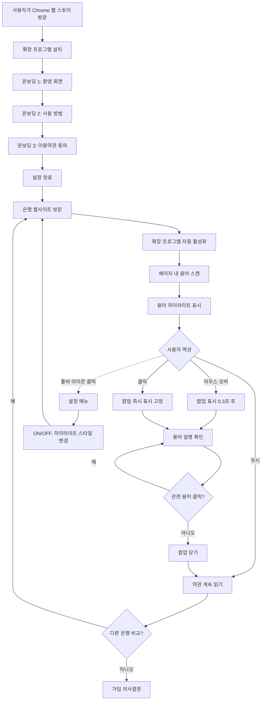

---

## 2. 확장 프로그램 설치 및 온보딩

### 2.1 Chrome 웹 스토어 페이지

확장 프로그램 설치 진입점으로서의 기본 구조입니다.

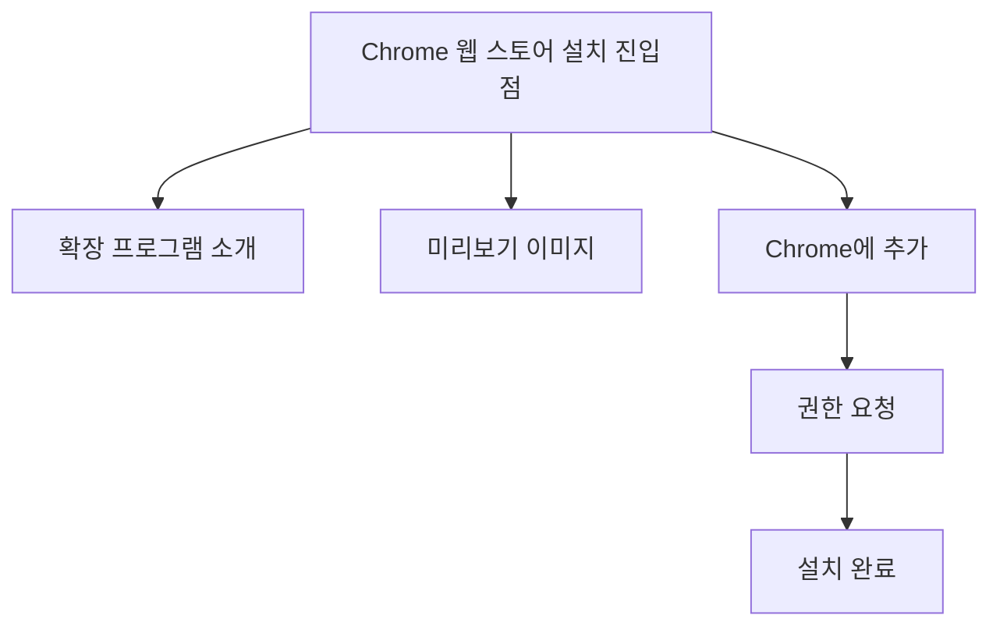

### 2.2 온보딩 화면 1: 환영 및 소개

설치 직후 나타나는 첫 번째 온보딩 화면입니다.

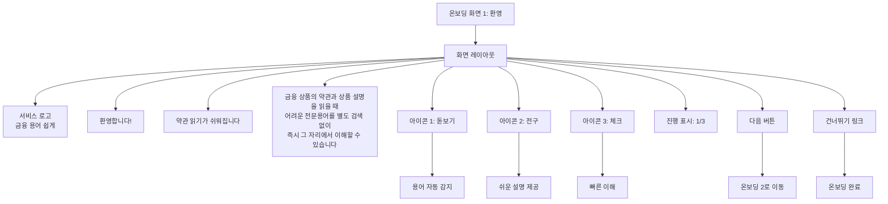

### 2.3 온보딩 화면 2: 사용 방법

서비스 사용 방법을 안내하는 두 번째 온보딩 화면입니다.

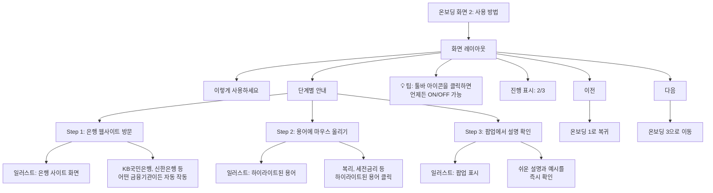

### 2.4 온보딩 화면 3: 이용약관 동의

법적 고지사항과 이용약관 동의를 받는 세 번째 온보딩 화면입니다.

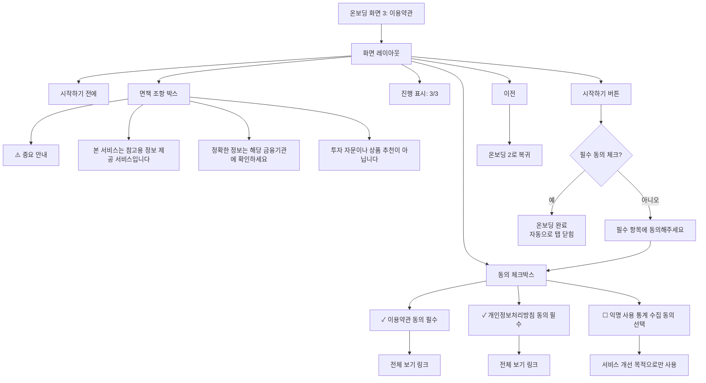

---

## 3. 핵심 기능 화면

### 3.1 은행 웹사이트 - 용어 하이라이트

사용자가 은행 웹사이트를 방문했을 때 확장 프로그램이 작동하는 화면입니다.

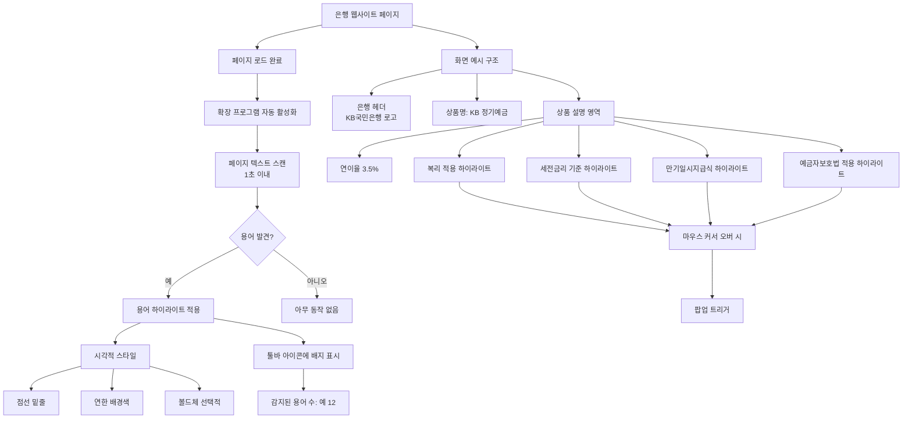

### 3.2 용어 팝업 - PC 버전

PC 환경에서 용어를 클릭했을 때 표시되는 팝업 구조입니다.

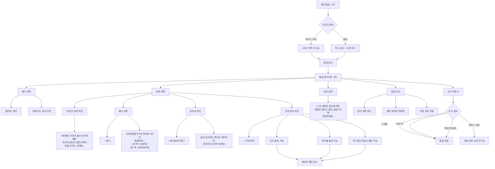

### 3.3 용어 팝업 - 모바일 버전

모바일 환경에서의 팝업 구조입니다.

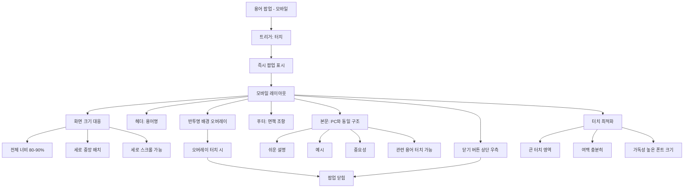

### 3.4 브라우저 툴바 확장 아이콘

브라우저 툴바에 표시되는 확장 프로그램 아이콘과 드롭다운 패널입니다.

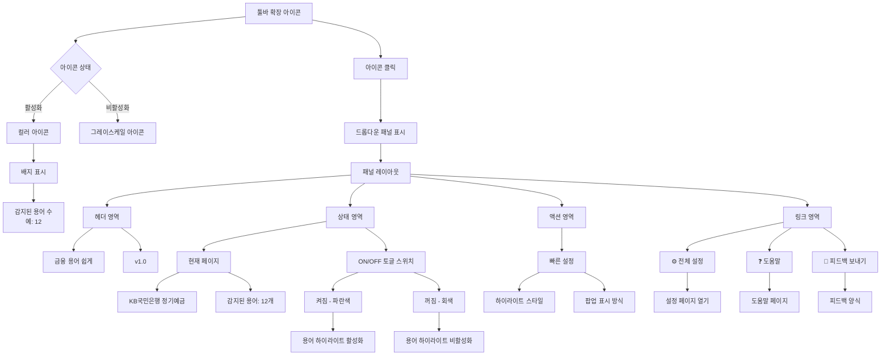

---

## 4. 설정 화면

### 4.1 설정 메뉴 구조

확장 프로그램의 설정 화면 전체 구조입니다.

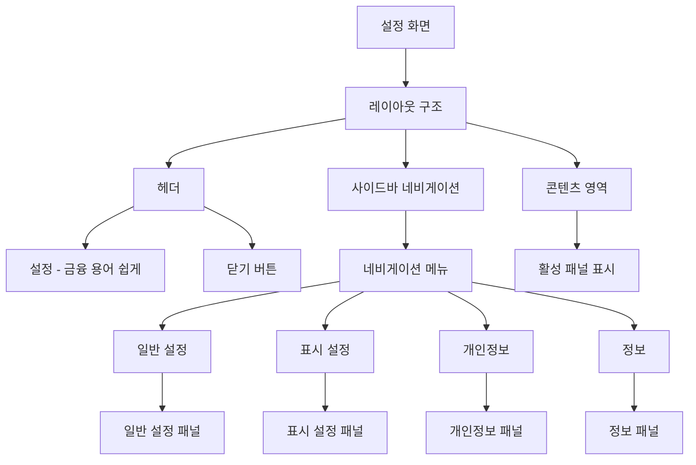

### 4.2 설정 항목 상세

각 설정 패널의 상세 항목들입니다.

```mermaid
graph TD
    SettingsDetail[설정 항목 상세]
    
    SettingsDetail --> Panel1[일반 설정 패널]
    SettingsDetail --> Panel2[표시 설정 패널]
    SettingsDetail --> Panel3[개인정보 패널]
    SettingsDetail --> Panel4[정보 패널]
    
    Panel1 --> G1[자동 활성화]
    G1 --> G1Toggle[ON/OFF 스위치<br/>기본: ON]
    G1 --> G1Desc[은행 사이트 방문 시<br/>자동으로 용어 감지]
    
    Panel1 --> G2[지원 사이트]
    G2 --> G2List[모든 금융기관 사이트<br/>특정 사이트만 선택 옵션]
    
    Panel2 --> D1[하이라이트 스타일]
    D1 --> D1Options[선택 옵션]
    D1Options --> D1Opt1[⚪ 점선 밑줄]
    D1Options --> D1Opt2[⚪ 배경 색상]
    D1Options --> D1Opt3[⚪ 밑줄 + 배경]
    
    Panel2 --> D2[하이라이트 색상]
    D2 --> D2Color[색상 선택기<br/>기본: 연한 파란색]
    
    Panel2 --> D3[팝업 표시 방식]
    D3 --> D3Options[선택 옵션]
    D3Options --> D3Opt1[⚪ 마우스 오버 + 클릭]
    D3Options --> D3Opt2[⚪ 클릭만]
    
    Panel2 --> D4[팝업 딜레이 시간]
    D4 --> D4Slider[슬라이더: 0.1초 ~ 1.0초<br/>기본: 0.3초]
    
    Panel2 --> PreviewBox[미리보기 영역]
    PreviewBox --> PreviewText[복리 하이라이트 예시]
    
    Panel3 --> P1[데이터 수집]
    P1 --> P1Checkbox[☐ 익명 사용 통계 수집 동의]
    P1 --> P1Desc[서비스 개선 목적으로만 사용<br/>개인정보는 수집하지 않습니다]
    
    Panel3 --> P2[로컬 데이터]
    P2 --> P2Info[비교 메모: 3건<br/>설정 정보: 로컬 저장]
    P2 --> P2Btn[모두 삭제 버튼]
    
    Panel3 --> P3[링크]
    P3 --> P3Link1[개인정보처리방침 보기]
    P3 --> P3Link2[이용약관 보기]
    
    Panel4 --> I1[서비스 정보]
    I1 --> I1Version[버전: 1.0.0]
    I1 --> I1Date[최종 업데이트: 2026-01-22]
    
    Panel4 --> I2[용어 사전]
    I2 --> I2Count[등록된 용어: 50개]
    I2 --> I2Category[카테고리: 금리, 상품구조, 세금 등]
    
    Panel4 --> I3[문의 및 피드백]
    I3 --> I3Email[이메일: support@example.com]
    I3 --> I3Github[GitHub 링크]
    
    Panel4 --> I4[법적 고지]
    I4 --> I4Text[본 서비스는 참고용 정보 제공<br/>투자 자문 아님]
```

---

## 5. 부가 기능 화면

### 5.1 비교 메모 기능

여러 은행 상품을 비교할 때 메모를 작성하는 기능입니다. (P3 우선순위)

```mermaid
graph TD
    Memo[비교 메모 기능]
    
    Memo --> Access[접근 방법]
    Access --> Method1[툴바 아이콘 클릭]
    Access --> Method2[드롭다운에서 메모 탭]
    
    Method1 --> MemoPanel[메모 패널]
    Method2 --> MemoPanel
    
    MemoPanel --> MLayout[레이아웃]
    
    MLayout --> MHeader[헤더: 상품 비교 메모]
    MLayout --> MList[메모 목록 영역]
    MLayout --> MAdd[+ 새 메모 버튼]
    
    MList --> MEmpty{메모 존재?}
    MEmpty -->|아니오| EmptyState[비어있음 상태]
    EmptyState --> EmptyMsg[아직 작성한 메모가 없어요]
    EmptyState --> EmptyBtn[첫 메모 작성하기]
    
    MEmpty -->|예| MItems[메모 아이템 목록]
    
    MItems --> Item1[메모 카드 1]
    MItems --> Item2[메모 카드 2]
    MItems --> Item3[메모 카드 3]
    
    Item1 --> IHeader[은행명: KB국민은행]
    Item1 --> ITime[작성: 5분 전]
    Item1 --> IContent[메모 내용:<br/>금리 3.5%, 복리 적용<br/>우대조건: 급여이체]
    Item1 --> IActions[수정 | 삭제]
    
    MAdd --> CreateMemo[메모 작성 화면]
    
    CreateMemo --> CLayout[작성 레이아웃]
    CLayout --> CBank[은행명 입력]
    CLayout --> CProduct[상품명 입력]
    CLayout --> CText[메모 내용 텍스트 영역]
    CLayout --> CSave[저장 버튼]
    CLayout --> CCancel[취소 버튼]
    
    CSave --> Validate{필수 항목 입력?}
    Validate -->|예| SaveSuccess[저장 완료]
    Validate -->|아니오| ErrorMsg[필수 항목을 입력하세요]
    
    SaveSuccess --> MList
```

### 5.2 이용약관 및 개인정보처리방침

법적 문서를 확인할 수 있는 화면입니다.

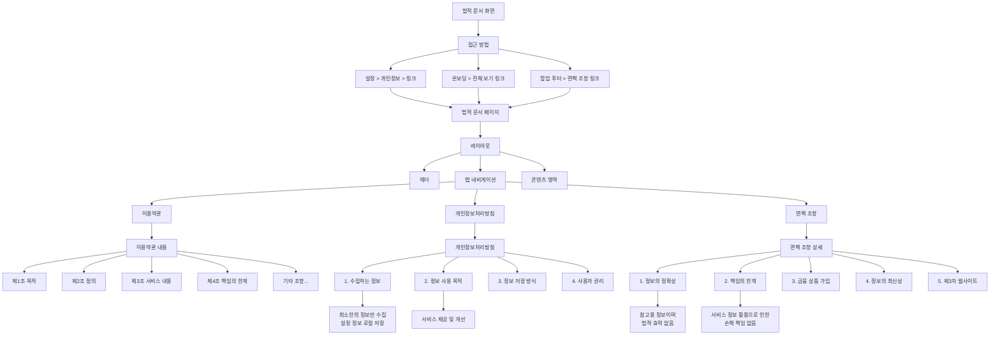

---

## 6. 주요 인터랙션 시나리오

### 6.1 시나리오 1: 첫 사용자의 여정

신규 사용자가 서비스를 처음 사용하는 전체 여정입니다.

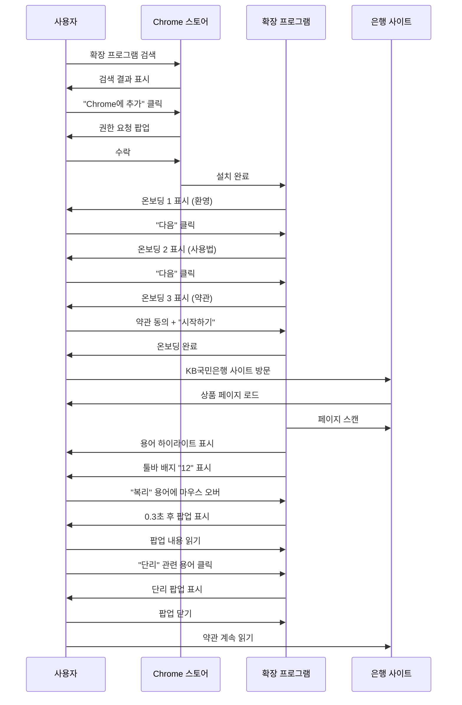

### 6.2 시나리오 2: 약관 읽기 중 용어 조회

사용자가 약관을 읽으면서 여러 용어를 조회하는 시나리오입니다.

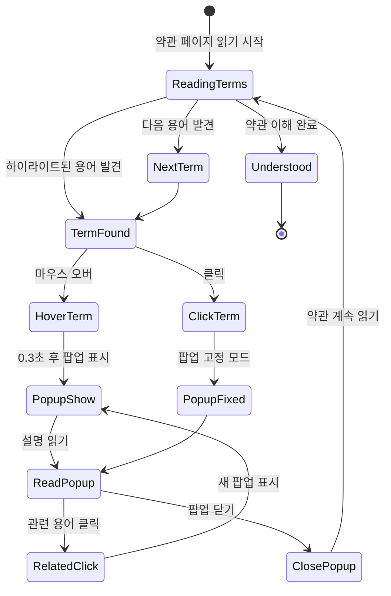

### 6.3 시나리오 3: 여러 은행 상품 비교

사용자가 여러 은행을 방문하며 상품을 비교하는 시나리오입니다.

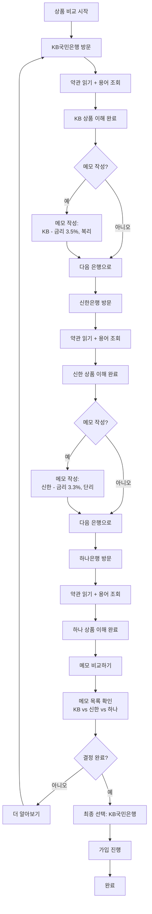

---

## 7. 기술적 구현 참고사항

### 7.1 반응형 디자인

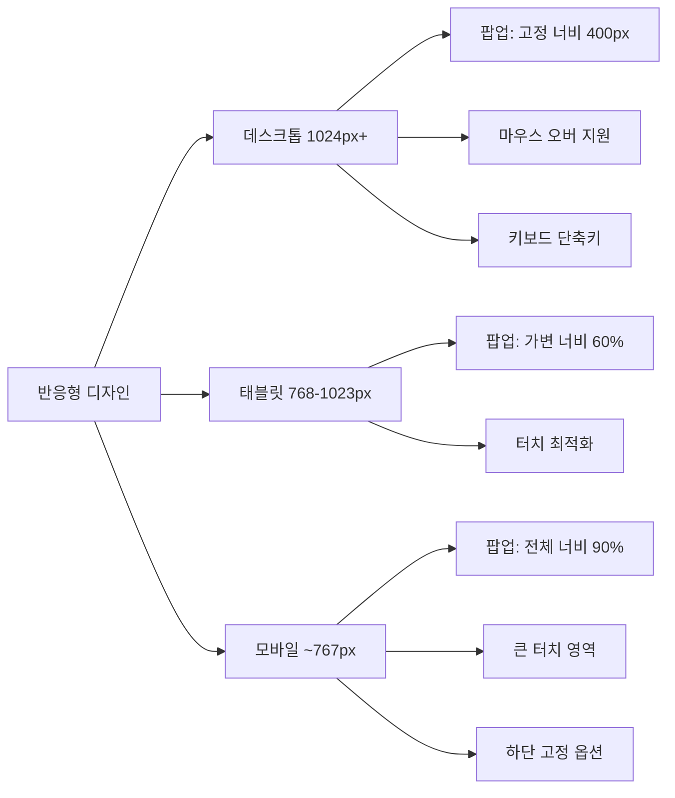

### 7.2 접근성 고려사항

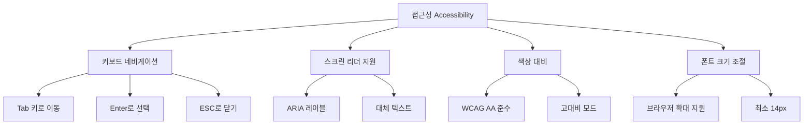

### 7.3 성능 최적화

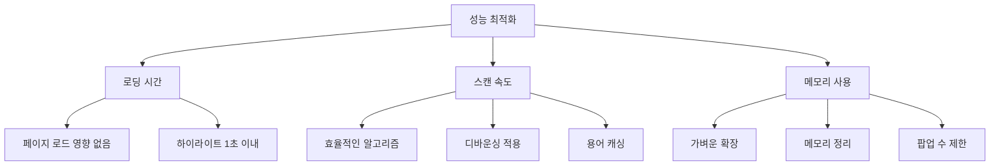

---

## 8. 디자인 시스템

### 8.1 컬러 팔레트

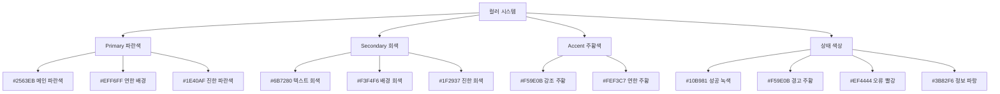

### 8.2 타이포그래피

```mermaid
graph TD
    Typography[타이포그래피]
    
    Typography --> FontFamily[폰트 패밀리]
    Typography --> FontSizes[폰트 크기]
    Typography --> FontWeights[폰트 굵기]
    
    FontFamily --> Korean[한글: Pretendard]
    FontFamily --> English[영문: Inter]
    FontFamily --> Fallback[Fallback: system-ui]
    
    FontSizes --> H1[H1: 24px 페이지 제목]
    FontSizes --> H2[H2: 20px 섹션 제목]
    FontSizes --> H3[H3: 18px 서브 제목]
    FontSizes --> Body[Body: 16px 본문]
    FontSizes --> Small[Small: 14px 보조]
    FontSizes --> Tiny[Tiny: 12px 캡션]
    
    FontWeights --> Bold[Bold: 700]
    FontWeights --> SemiBold[SemiBold: 600]
    FontWeights --> Regular[Regular: 400]
```

---

## 부록: 와이어프레임 버전 이력

| 버전 | 작성일 | 주요 변경사항 |
|------|--------|--------------|
| v1.0 | 2026-01-22 | 최초 작성 - 전체 화면 구조 및 플로우 다이어그램 작성 |

---

**문서 종료**
