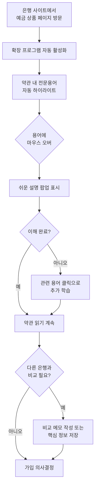
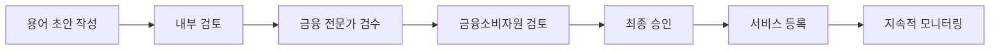

# 금융 용어 해설 서비스 MVP 기획안

> **"금융 용어 쉽게"** - 금융 상품 약관 내 전문용어를 쉬운 말로 자동 치환·해설하여 약관 화면에서 바로 확인할 수 있는 브라우저 확장 프로그램  
> **문서 버전**: v1.0 | **최종 수정일**: 2026-01-21 | **작성자**: judy0

---

# 목차

1. [서비스 개요](#1-서비스-개요)
2. [타겟 사용자 및 페르소나](#2-타겟-사용자-및-페르소나)
3. [MVP 기능 정의 및 우선순위](#3-mvp-기능-정의-및-우선순위)
4. [사용자 경험 플로우](#4-사용자-경험-플로우)
5. [용어 사전 구성 계획](#5-용어-사전-구성-계획)
6. [법적/규제 준수](#6-법적규제-준수)
7. [콘텐츠 검증 프로세스](#7-콘텐츠-검증-프로세스)
8. [성공 지표 및 출시 전략](#8-성공-지표-및-출시-전략)
9. [향후 확장 로드맵](#9-향후-확장-로드맵)

---

# 1. 서비스 개요

## 1.1 서비스 명
**금융 용어 쉽게** (가칭)

## 1.2 핵심 가치 제안
금융 상품 약관을 읽다가 어려운 용어를 만났을 때, 별도로 검색하지 않고 **즉시 그 자리에서** 쉬운 설명을 확인할 수 있는 브라우저 확장 프로그램

## 1.3 해결하고자 하는 문제
- 금융 상품 약관에 등장하는 전문용어를 이해하지 못해 상품 가입을 망설이거나 잘못된 선택을 하는 경우
- 용어를 검색하기 위해 약관 페이지를 이탈하면 맥락이 끊기고 비교가 어려워짐
- 금융 문맹으로 인한 소비자의 불안감과 의사결정 부담

## 1.4 MVP 범위

### 금융 상품
- **예금**: 정기예금, 자유적립예금, 파킹통장
- **적금**: 정기적금, 자유적립식 적금

### 금융기관
- **시중은행**: KB국민, 신한, 하나, 우리, NH농협 등
- **인터넷은행**: 카카오뱅크, 토스뱅크, 케이뱅크
- **지방은행**: 부산, 대구, 광주, 경남, 전북 등
- **기타**: 새마을금고, 신협, 우체국

**구현 방식**: 특정 사이트 구조에 종속되지 않고, 웹페이지 내 텍스트를 일반적으로 스캔하는 방식으로 **모든 금융기관 사이트**에서 범용적으로 동작

---

# 2. 타겟 사용자 및 페르소나

## 2.1 주요 타겟
- **모든 연령대의 일반 소비자**
- 금융 상품 가입 시 약관을 꼼꼼히 읽고 싶지만 전문용어 때문에 어려움을 겪는 사람
- 예금/적금 상품 비교를 위해 여러 은행 사이트를 방문하는 사람

## 2.2 상세 페르소나

### 페르소나 1: 직장인 김지수 (32세)

**기본 정보**
- 직업: IT 기업 마케팅 팀 대리
- 거주지: 서울 강남구
- 연소득: 4,500만원
- 금융 자산: 약 2,000만원

**배경**  
입사 5년차로 첫 목돈을 모았습니다. 회사 근처 은행 지점을 몇 번 방문했지만, 직원이 권하는 상품을 그대로 가입하기엔 불안했습니다. 퇴근 후 집에서 여러 은행 홈페이지를 방문해 상품을 비교하려 하지만, 약관에 나오는 용어들이 낯설어 이해하는 데 시간이 오래 걸립니다.

**목표와 니즈**
- 🎯 여러 은행의 예금/적금 상품을 꼼꼼히 비교하고 싶음
- 🎯 은행 직원의 설명 없이도 스스로 이해하고 가입하고 싶음
- 🎯 금융 지식을 쌓아 더 나은 재테크를 하고 싶음

**페인 포인트**
- ❌ "만기일시지급식", "복리", "세전이율" 같은 용어를 매번 검색하느라 시간 소비
- ❌ 검색창으로 이동하면 어느 은행 페이지를 보고 있었는지 헷갈림
- ❌ 용어마다 설명이 너무 어렵거나 광고성 콘텐츠가 섞여 있음

---

### 페르소나 2: 대학생 이준호 (24세)

**기본 정보**
- 직업: 대학교 4학년 재학 중 + 편의점 아르바이트
- 거주지: 경기도 수원시 (자취)
- 월소득: 약 120만원 (용돈 50만원 + 알바 70만원)
- 금융 자산: 약 300만원

**배경**  
생활비를 빼고 남는 돈을 모으기 위해 적금을 시작하려고 합니다. 부모님이나 친구들에게 물어보기엔 금융 지식이 없다는 게 부끄럽습니다. 토스, 카카오뱅크 같은 앱은 익숙하지만, 정작 상품 설명을 읽으면 무슨 말인지 잘 모르겠습니다.

**목표와 니즈**
- 🎯 매달 20-30만원 정도 꾸준히 저축하고 싶음
- 🎯 금융 용어를 몰라도 쉽게 이해하고 가입하고 싶음
- 🎯 스스로 해결하는 능력을 키우고 싶음

**페인 포인트**
- ❌ 금융 기초 지식이 부족해서 약관이 외계어처럼 느껴짐
- ❌ 부모님께 물어보면 "은행 가서 물어봐"라는 답변만 돌아옴
- ❌ 검색해도 너무 어렵게 설명되어 있거나 광고만 나옴

---

### 페르소나 3: 은퇴자 박영희 (65세)

**기본 정보**
- 직업: 은퇴 (전 공무원)
- 거주지: 부산광역시
- 금융 자산: 약 2억원 (퇴직금 포함)

**배경**  
최근 퇴직하여 퇴직금을 안전하게 예금하려고 합니다. 과거 불완전판매로 손해를 본 경험이 있어, 이번에는 꼼꼼히 확인하고 가입하고 싶습니다. 하지만 최근 금융 용어들이 과거와 달라진 것 같고, 온라인 절차도 낯설어서 어렵습니다.

**목표와 니즈**
- 🎯 퇴직금을 안전하게 보관하고 이자 수익 얻고 싶음
- 🎯 손해 보지 않도록 약관을 정확히 이해하고 싶음
- 🎯 자녀에게 부담 주지 않고 스스로 해결하고 싶음

**페인 포인트**
- ❌ "중도해지이율", "이자소득세" 등이 예전과 달라져서 헷갈림
- ❌ 창구 직원이 빨리 설명해서 놓치는 내용이 많음
- ❌ 온라인으로 하려니 화면도 작고 용어도 어려움

---

### 페르소나 4: 프리랜서 최민지 (28세)

**기본 정보**
- 직업: 프리랜서 디자이너
- 거주지: 서울 홍대 인근
- 월소득: 불규칙 (평균 250만원)
- 금융 자산: 약 800만원

**배경**  
불규칙한 수입 때문에 비상금을 모으는 게 중요합니다. 자유입출금이 가능하면서도 이자를 받을 수 있는 상품을 찾고 있습니다. 여러 상품을 비교하다 보면 "CMA", "MMDA", "파킹통장" 등 비슷한 것 같으면서도 다른 용어들이 혼란스럽습니다.

**목표와 니즈**
- 🎯 자유롭게 입출금하면서도 이자 받을 수 있는 상품 찾기
- 🎯 여러 상품의 미묘한 차이를 정확히 이해하고 싶음
- 🎯 빠르게 비교하고 결정하고 싶음

**페인 포인트**
- ❌ CMA, MMDA, RP 등 약자가 많아서 무슨 뜻인지 모르겠음
- ❌ 비슷해 보이는 상품들의 차이를 파악하기 어려움
- ❌ 프리랜서 특성상 시간이 부족해서 빠른 결정 필요

---

## 2.3 공통 페인 포인트

모든 페르소나가 공통적으로 겪는 어려움:

1. **약관 이탈 문제**: 용어를 검색하려고 페이지를 벗어나면 맥락이 끊김
2. **시간 소비**: 용어 하나하나 검색하느라 상품 비교에 시간이 오래 걸림
3. **설명의 난이도**: 검색 결과가 여전히 어렵거나 광고성 콘텐츠
4. **비교의 어려움**: 여러 은행을 오가며 비교할 때 헷갈림

---

# 3. MVP 기능 정의 및 우선순위

## 3.1 MVP 목표
최소한의 기능으로 **"예금/적금 약관 읽기가 쉬워진다"**는 핵심 가치를 검증하고, 사용자 피드백을 빠르게 수집합니다.

## 3.2 MVP 성공 기준
- 30-50개 핵심 용어에 대한 즉시 해설 제공
- 주요 5개 은행 사이트에서 정상 작동
- 사용자 만족도 4.0/5.0 이상
- 첫 달 500명 이상 설치

## 3.3 핵심 기능 (Must-Have)

### 기능 1: 전문용어 자동 감지 및 하이라이트 ⭐⭐⭐⭐⭐
**우선순위**: 최우선 (P0)

**기능 설명**
- 웹페이지 로드 시 자동으로 금융 용어 스캔
- 30-50개 등록된 용어를 텍스트에서 자동 감지
- 감지된 용어에 시각적 표시 (예: 점선 밑줄, 하이라이트 색상)

**세부 요구사항**
- 페이지 로드 후 1초 이내에 하이라이트 완료
- 대소문자 구분 없이 감지
- 띄어쓰기 변형도 감지 (예: "세전금리", "세전 금리")
- 이미 하이라이트된 텍스트는 중복 처리 안 함

**성공 지표**
- 등록된 용어의 95% 이상 정확히 감지
- 오탐지율 5% 이하

---

### 기능 2: 즉시 해설 팝업 ⭐⭐⭐⭐⭐
**우선순위**: 최우선 (P0)

**기능 설명**
- 하이라이트된 용어에 마우스 오버 또는 터치 시 팝업 표시
- 쉬운 설명, 예시, 관련 용어 제공

**세부 요구사항**

**PC 환경**
- 마우스 오버: 0.3초 지연 후 팝업 표시 (실수 방지)
- 클릭: 즉시 팝업 표시 + 고정 모드 (스크롤해도 화면에 고정)
- 팝업 위치: 용어 바로 위 또는 아래 (화면 밖으로 나가지 않도록 자동 조정)

**모바일 환경**
- 터치: 즉시 팝업 표시
- 팝업 외부 터치 시 닫힘
- 화면 크기에 맞게 팝업 크기 조정

**팝업 내용 구성**
```
┌─────────────────────────────┐
│ [용어명]                     │
│                             │
│ [쉬운 말 설명]               │
│ (1-2문장)                   │
│                             │
│ 💡 예시                     │
│ [구체적 숫자 예시]           │
│                             │
│ 🔗 관련 용어                │
│ • [용어1] • [용어2]          │
│                             │
│ ※ 본 설명은 참고용이며,     │
│ 정확한 정보는 해당 금융기관에│
│ 확인하세요.                 │
│                             │
│        [닫기 버튼]           │
└─────────────────────────────┘
```

**성공 지표**
- 팝업 표시 속도 0.3초 이내
- 사용자 1인당 평균 5개 이상 용어 조회

---

### 기능 3: 확장 프로그램 ON/OFF 토글 ⭐⭐⭐⭐
**우선순위**: 높음 (P1)

**기능 설명**
- 브라우저 툴바의 확장 프로그램 아이콘 클릭 시 기능 활성화/비활성화
- 현재 페이지에서 감지된 용어 개수 표시

**세부 요구사항**
- 아이콘 배지에 숫자로 감지된 용어 수 표시
- ON/OFF 상태 시각적 구분 (색상 변화)
- 상태는 탭별로 독립적으로 관리
- 설정은 브라우저 저장소에 저장 (재방문 시 유지)

---

### 기능 4: 기본 설정 메뉴 ⭐⭐⭐
**우선순위**: 중간 (P2)

**포함 설정 항목**
- 자동 활성화 ON/OFF (기본: ON)
- 하이라이트 스타일 선택 (밑줄/배경색)
- 팝업 표시 방식 (마우스 오버/클릭만)
- 팝업 딜레이 시간 조정 (0.1초 ~ 1초)

---

## 3.4 부가 기능 (Nice-to-Have)

### 기능 5: 상품 비교 메모 기능 ⭐⭐
**우선순위**: 낮음 (P3)

**기능 설명**
- 여러 은행 사이트를 방문하며 상품을 비교할 때 도움을 주는 기능
- 각 은행 페이지별로 간단한 텍스트 메모 작성
- 메모 목록 보기 기능

**성공 지표**
- 메모 작성 사용자 비율 5% 이상

---

## 3.5 MVP 제외 기능 (Post-MVP)

다음 기능들은 Phase 2 이후로 미룹니다:

1. **용어 북마크/저장 기능** → Phase 2 (학습 기능과 함께)
2. **용어 학습/퀴즈 기능** → Phase 2
3. **용어 조회 히스토리** → Phase 2
4. **AI 기반 맞춤 설명** → Phase 3
5. **약관 전체 요약 기능** → Phase 3
6. **상품 추천 기능** → Phase 4 (신중 검토)

---

# 4. 사용자 경험 플로우

## 4.1 전체 사용 시나리오



## 4.2 주요 인터랙션

### 확장 프로그램 설치 직후
- 간단한 온보딩: 서비스 소개 + 사용법 (3페이지 이내)
- 권장 사용 사이트 안내

### 금융 사이트 방문 시
- 페이지 로드 완료 후 자동으로 용어 스캔
- 하이라이트 적용 (0.5-1초 이내)
- 툴바 아이콘에 배지로 감지된 용어 수 표시

### 용어 조회
- 마우스 오버: 0.3초 딜레이 후 팝업 (실수 방지)
- 클릭: 즉시 팝업 + 고정 (스크롤해도 유지)
- ESC 키 또는 팝업 밖 클릭으로 닫기

## 4.3 사용 시나리오 예시

### 김지수의 하루 (서비스 사용 후)

1. 퇴근 후 집에서 노트북으로 KB국민은행 정기예금 페이지 방문
2. 약관을 읽다가 "만기일시지급식"이라는 용어 발견 → 자동 하이라이트
3. 마우스를 올리자 팝업으로 "만기가 되었을 때 한꺼번에 원금과 이자를 받는 방식" 설명 확인
4. 관련 용어인 "월지급식"도 클릭해서 차이 이해
5. 다음 은행(신한은행) 페이지로 이동해도 같은 방식으로 용어 이해하며 비교
6. 30분 만에 4개 은행 상품 비교 완료하고 가입 결정

---

# 5. 용어 사전 구성 계획

## 5.1 MVP 용어 범위

### 목표
**30-50개의 핵심 금융 용어**를 선정하여 예금/적금 상품 약관 이해도를 80% 이상 높입니다.

### 선정 기준
1. **빈도**: 대부분의 예금/적금 약관에 등장하는 용어
2. **중요도**: 상품 선택과 수익에 직접적인 영향을 미치는 용어
3. **난이도**: 일반 소비자가 이해하기 어려운 전문 용어
4. **혼동성**: 비슷한 용어와 혼동하기 쉬운 용어

## 5.2 용어 카테고리 및 리스트

### 1. 금리 관련 (10개)

| 용어 | 우선순위 | 선정 이유 |
|------|---------|----------|
| 연이율 | 필수 | 가장 기본적인 금리 표시 단위 |
| 월이율 | 필수 | 연이율과 혼동하기 쉬움 |
| 단리 | 필수 | 복리와의 차이 이해 필수 |
| 복리 | 필수 | 수익률에 큰 영향, 이해 어려움 |
| 세전금리 | 필수 | 실수령액 계산에 필수 |
| 세후금리 | 필수 | 실제 수익률 이해에 필수 |
| 우대금리 | 필수 | 조건 이해가 중요함 |
| 기본금리 | 권장 | 우대금리와 구분 필요 |
| 실질금리 | 권장 | 물가를 고려한 실제 수익 |
| 명목금리 | 선택 | 실질금리와의 차이 |

### 2. 상품 구조 (12개)

| 용어 | 우선순위 | 선정 이유 |
|------|---------|----------|
| 만기일시지급식 | 필수 | 가장 흔한 지급 방식 |
| 월지급식 | 필수 | 만기일시지급과 비교 필요 |
| 정기예금 | 필수 | 기본 상품 유형 |
| 정기적금 | 필수 | 예금과 혼동 방지 |
| 자유적립식 | 필수 | 정액적립과 구분 |
| 정액적립식 | 필수 | 납입 방식 이해 |
| 거치식 | 권장 | 이자 계산 방식 |
| 적립식 | 권장 | 거치식과 비교 |
| 중도해지 | 필수 | 불이익 이해 필수 |
| 만기 | 필수 | 기본 개념 |
| 자동연장 | 권장 | 만기 후 처리 방식 |
| 자동해지 | 권장 | 자동연장과 구분 |

### 3. 세금 및 비용 (10개)

| 용어 | 우선순위 | 선정 이유 |
|------|---------|----------|
| 이자소득세 | 필수 | 실수령액 계산 필수 |
| 지방소득세 | 필수 | 이자소득세와 함께 부과 |
| 원천징수 | 필수 | 세금 처리 방식 |
| 비과세 | 필수 | 세금 혜택 이해 |
| 세금우대 | 필수 | 비과세와 구분 |
| 금융소득종합과세 | 권장 | 고액 자산가에게 중요 |
| 과세표준 | 선택 | 세금 계산 기초 |
| 분리과세 | 선택 | 종합과세와 구분 |
| 농어촌특별세 | 선택 | 비과세 상품 관련 |
| 소득공제 | 선택 | 연말정산 관련 |

### 4. 예금 보호 (6개)

| 용어 | 우선순위 | 선정 이유 |
|------|---------|----------|
| 예금자보호법 | 필수 | 안전성 이해 필수 |
| 예금보험공사 | 필수 | 보호 주체 |
| 보호한도 | 필수 | 5천만원 한도 이해 |
| 원금 | 필수 | 기본 개념 |
| 이자 | 필수 | 기본 개념 |
| 1인당 5천만원 | 권장 | 보호한도 구체화 |

### 5. 특수 상품 및 기타 (12개)

| 용어 | 우선순위 | 선정 이유 |
|------|---------|----------|
| CMA | 필수 | 자주 보는 약자, 혼동 많음 |
| MMDA | 필수 | CMA와 유사하여 혼동 |
| RP (환매조건부채권) | 권장 | 단기 상품 이해 |
| 파킹통장 | 필수 | 유행하는 용어 |
| 입출금자유예금 | 필수 | 기본 상품 유형 |
| 요구불예금 | 권장 | 정기예금과 구분 |
| 저축예금 | 권장 | 일반 예금과 구분 |
| 보통예금 | 권장 | 가장 기본 상품 |
| 기업자유예금 | 선택 | 기업용 상품 |
| 장단기차익 | 선택 | 금융 상품 이해 |
| CD (양도성예금증서) | 선택 | 특수 상품 |
| 정기예탁금 | 선택 | 신협 등에서 사용 |

## 5.3 용어 설명 작성 가이드

### 기본 구조

각 용어는 다음 구조로 작성합니다:

```markdown
### [용어명]

**쉬운 말 설명**
- 초등학생도 이해할 수 있는 수준의 쉬운 표현 (1-2문장)

**구체적 예시**
- 숫자를 사용한 실생활 예시

**왜 중요한가요?**
- 이 용어가 상품 선택이나 수익에 미치는 영향

**관련 용어**
- 함께 알아두면 좋은 용어 (2-3개)
```

### 작성 원칙

1. **쉬운 언어**: 중학생 수준에서 이해 가능한 표현
2. **구체적 예시**: 추상적 개념은 반드시 숫자 예시 포함
3. **비교 설명**: 유사 용어와의 차이점 명확히 제시
4. **실용성**: "이 용어가 왜 중요한지, 어떤 영향을 미치는지" 포함

## 5.4 용어 설명 예시

### 예시 1: 복리

**쉬운 말 설명**  
복리는 이자에도 이자가 붙는 방식이에요. 마치 눈덩이가 굴러가면서 점점 커지는 것처럼, 시간이 지날수록 받는 이자가 점점 많아집니다.

**구체적 예시**  
100만원을 연 3% 복리로 2년간 예금한다면:
- 1년 후: 100만원 + 3만원(이자) = 103만원
- 2년 후: 103만원 + 3만 900원(이자) = 106만 900원

같은 조건으로 단리로 예금하면 106만원이므로, 복리가 900원 더 유리해요. 기간이 길수록, 금액이 클수록 차이는 더 커집니다.

**왜 중요한가요?**  
같은 금리라도 복리로 계산하면 단리보다 수익이 많아요. 장기 예금일수록 복리 상품을 선택하는 것이 유리합니다.

**관련 용어**  
- [단리]: 원금에만 이자가 붙는 방식
- [연이율]: 1년 동안의 이자율
- [만기일시지급식]: 복리 효과를 최대화할 수 있는 지급 방식

---

### 예시 2: 우대금리

**쉬운 말 설명**  
우대금리는 특정 조건을 충족하면 기본 금리에 더해서 받는 추가 금리예요. 은행이 정한 미션을 완료하면 보너스 금리를 주는 것이라고 생각하면 됩니다.

**구체적 예시**  
기본금리 3%인 예금 상품에서:
- 급여이체 시: +0.3%
- 자동이체 3건 이상: +0.2%
- 신규 고객: +0.5%

→ 모든 조건을 충족하면 총 4.0%의 금리를 받을 수 있어요.

**왜 중요한가요?**  
광고에 보이는 "최고 금리"는 보통 모든 우대 조건을 충족했을 때의 금리예요. 본인이 실제로 충족할 수 있는 조건을 확인하고, 실제 받을 금리를 계산하는 것이 중요합니다.

**관련 용어**  
- [기본금리]: 조건 없이 받는 기본 이자율
- [연이율]: 1년 동안의 이자율
- [세전금리]: 세금을 떼기 전의 금리

---

### 예시 3: 중도해지

**쉬운 말 설명**  
중도해지는 예금이나 적금의 약속 기간이 끝나기 전에 미리 해지하는 것이에요. 급하게 돈이 필요할 때 찾을 수 있지만, 원래 약속한 이자보다 적게 받게 됩니다.

**구체적 예시**  
1년 만기 연 3% 적금에 100만원을 넣었는데, 6개월 만에 해지한다면:
- 원래 받을 이자: 약 1만 5천원
- 중도해지 이자 (1% 적용): 약 5천원
- 손해: 약 1만원

**왜 중요한가요?**  
중도해지하면 이자를 거의 못 받거나 예상보다 훨씬 적게 받아요. 예금이나 적금을 가입하기 전에, 중간에 돈을 꺼낼 일이 없는지 신중하게 생각해야 합니다.

**관련 용어**  
- [만기]: 예금/적금 계약 기간이 끝나는 시점
- [중도해지이율]: 중도해지 시 적용되는 낮은 이자율
- [약정이율]: 원래 약속한 이자율

## 5.5 용어 작성 체크리스트

각 용어를 작성할 때 다음 항목을 확인합니다:

- [ ] 쉬운 말 설명이 2-3문장 이내로 명확한가?
- [ ] 중학생이 읽어도 이해할 수 있는 수준인가?
- [ ] 구체적인 숫자 예시가 포함되어 있는가?
- [ ] 실생활과 연결된 예시인가?
- [ ] 왜 중요한지 설명되어 있는가?
- [ ] 비슷한 용어와의 차이가 명확한가?
- [ ] 관련 용어 링크가 2-3개 포함되어 있는가?
- [ ] 전문가가 검수했는가?

---

# 6. 법적/규제 준수

## 6.1 서비스 법적 성격

### 정보 제공 서비스
본 서비스는 **금융 상품 판매나 중개가 아닌**, 금융 용어에 대한 **참고 정보를 제공하는 교육적 도구**입니다.

- ✅ 용어 설명 및 해설 제공
- ✅ 일반적인 금융 지식 전달
- ❌ 특정 상품 추천이나 권유
- ❌ 투자 자문이나 금융 상담

## 6.2 면책 조항 (Disclaimer)

### 서비스 내 명시 위치

면책 조항은 다음 위치에 명확히 표시됩니다:

1. **확장 프로그램 설치 페이지**: Chrome 웹 스토어 설명란에 명시
2. **첫 설치 후 온보딩 화면**: 사용자가 처음 서비스를 사용할 때 반드시 확인
3. **각 용어 팝업 하단**: 모든 용어 설명 팝업 하단에 간략히 표시
4. **설정 메뉴 내 '이용약관' 섹션**: 전체 이용약관 및 면책 조항 확인 가능

### 면책 조항 문구

#### 팝업 내 간략 버전
```
※ 본 설명은 참고용이며, 정확한 정보는 해당 금융기관에 확인하세요.
```

#### 온보딩/이용약관 상세 버전
```
【면책 조항】

1. 정보의 정확성
   본 서비스에서 제공하는 금융 용어 설명은 일반적인 참고 정보이며,
   법적 효력이나 구속력을 갖지 않습니다. 정확한 정보는 해당 금융기관 
   또는 금융감독원에 문의하시기 바랍니다.

2. 책임의 한계
   본 서비스의 정보를 활용하여 발생한 어떠한 손해에 대해서도 
   서비스 제공자는 법적 책임을 지지 않습니다.

3. 금융 상품 가입
   실제 금융 상품 가입 시에는 반드시 해당 금융기관의 공식 약관을
   확인하시고, 필요시 전문가의 상담을 받으시기 바랍니다.

4. 정보의 최신성
   금융 관련 법규와 용어는 수시로 변경될 수 있으며, 본 서비스는
   최신 정보 반영에 시간이 소요될 수 있습니다.

5. 제3자 웹사이트
   본 서비스는 제3자 웹사이트(은행 등)에서 작동하며, 해당 웹사이트의
   내용에 대해서는 책임을 지지 않습니다.
```

## 6.3 개인정보 처리 방침

### 수집하는 정보 (최소화 원칙)

**MVP에서 수집하는 정보**
- ✅ 확장 프로그램 설정 정보 (로컬 저장)
- ✅ 익명화된 사용 통계 (선택적, 옵트인)
  - 조회된 용어 빈도
  - 사용 시간대
  - 브라우저 종류

**수집하지 않는 정보**
- ❌ 이름, 이메일 등 개인 식별 정보
- ❌ 방문한 구체적인 URL이나 페이지 내용
- ❌ 금융 상품 선택이나 가입 정보

### 데이터 저장 방식

**로컬 저장**
- 사용자 설정 (ON/OFF, 팝업 옵션 등)
- 비교 메모 (선택 기능 사용 시)
→ 사용자의 브라우저에만 저장, 서버 전송 없음

**서버 전송 (옵트인 시)**
- 익명화된 통계 정보만 전송
- 개인 식별 불가능한 형태
- 언제든지 옵트아웃 가능

## 6.4 관련 법규 준수

### 금융 관련 법규
- **금융소비자 보호에 관한 법률**: 금융 상품 판매/중개가 아니므로 직접 적용 대상은 아니나 소비자 보호 정신 준수
- **전자금융거래법**: 금융거래 행위를 하지 않으므로 적용 대상 아님

### 정보통신 관련 법규
- **개인정보 보호법**: 개인정보 최소 수집 원칙 준수, 개인정보처리방침 명시
- **전기통신사업법**: 이용자 보호 관련 조항 준수

### 소비자 보호 법규
- **표시·광고의 공정화에 관한 법률**: 과장 광고 금지, 사실과 다른 표현 금지

## 6.5 리스크 관리 방안

### 정보 정확성 검증
- 다단계 검증 프로세스 (내부 검토 → 금융 전문가 → 금융소비자원)
- 분기별 1회 용어 사전 전체 검토
- 금융 법규 변경 시 즉시 반영

### 사용자 오해 방지
- "~입니다" (단정) → "일반적으로 ~를 의미합니다" (안내)
- "이 상품이 좋습니다" (권유) 금지
- 복잡한 경우 "자세한 사항은 금융기관에 문의하세요" 추가

### 금융기관과의 관계
- 은행 로고나 상표 무단 사용 금지
- 특정 금융기관 편향 금지
- 모든 금융기관을 동등하게 대우

## 6.6 출시 전 법적 검토 체크리스트

### 문서 준비
- [ ] 이용약관 작성 및 법률 검토 완료
- [ ] 개인정보처리방침 작성 및 검토 완료
- [ ] 면책 조항 모든 위치에 명시 완료

### 콘텐츠 검증
- [ ] 30-50개 모든 용어 전문가 검수 완료
- [ ] 오해의 소지가 있는 표현 수정 완료
- [ ] 특정 상품 권유 표현 없음 확인

### UI/UX
- [ ] 첫 사용 시 이용약관 동의 절차 구현
- [ ] 모든 팝업에 간략 면책 조항 표시
- [ ] 설정 메뉴에서 전체 약관 확인 가능

### 개인정보 보호
- [ ] 최소한의 정보만 수집 확인
- [ ] 로컬 저장 우선 원칙 구현
- [ ] 옵트인 방식의 통계 수집 구현

### 지적재산권
- [ ] 제3자 콘텐츠 무단 사용 없음 확인
- [ ] 금융기관 로고/상표 무단 사용 없음
- [ ] 출처 명시 필요한 부분 표시 완료

---

# 7. 콘텐츠 검증 프로세스

## 7.1 검증 목표

### 핵심 원칙
1. **정확성**: 금융 법규와 실무에 부합하는 정확한 정보
2. **이해도**: 일반 소비자가 쉽게 이해할 수 있는 설명
3. **중립성**: 특정 금융기관이나 상품에 편향되지 않은 객관적 정보
4. **최신성**: 현행 법규와 시장 관행을 반영한 정보

## 7.2 검증 단계 개요



**전체 프로세스 소요 시간**
- 용어당 평균 검증 시간: 2-3일
- 30개 용어 일괄 검증: 약 2주 (병렬 진행 시)

## 7.3 단계별 검증 프로세스

### 1단계: 초안 작성
**담당**: 내부 콘텐츠 팀

**작업 내용**
- 금융감독원, 한국은행, 주요 금융기관의 공식 자료 참고
- 용어 작성 가이드 준수
- 초안 작성 시 출처 명시

**품질 기준**
- [ ] 중학생 이해 가능한 수준의 언어
- [ ] 구체적 숫자 예시 포함
- [ ] 2개 이상의 신뢰할 수 있는 출처 참고

---

### 2단계: 내부 검토
**담당**: 프로젝트 매니저 + 동료 검토자

**체크 항목**
- [ ] 템플릿 형식 준수
- [ ] 맞춤법, 띄어쓰기 오류 없음
- [ ] 설명이 명확하고 이해하기 쉬운가?
- [ ] 예시가 적절하고 현실적인가?
- [ ] 유사 용어와의 차이가 명확한가?
- [ ] 다른 용어 설명과 톤앤매너 일치

**결과**
- ✅ 통과: 다음 단계로 진행
- 🔄 수정 필요: 작성자에게 피드백 후 재작성
- ❌ 재작성: 큰 수정이 필요한 경우 처음부터 재작성

---

### 3단계: 금융 전문가 검수 (1차)
**담당**: 외부 금융 전문가

**자격 요건 (하나 이상 충족)**
- 금융기관 실무 경력 5년 이상
- 공인회계사, 세무사, 재무설계사(CFP) 자격 보유
- 금융 관련 학위 + 연구/교육 경력 3년 이상

**검수 내용**
- 전문가에게 10-15개 용어 배정 (부담 최소화)
- 전문가의 특화 분야 고려 배정

**검수 항목**
- [ ] 금융 용어의 정의가 정확한가?
- [ ] 법적/제도적 내용이 현행 규정과 일치하는가?
- [ ] 수치 예시의 계산이 정확한가?
- [ ] 실무와 괴리되는 설명은 없는가?
- [ ] 중요한 예외 사항이나 주의점이 빠지지 않았는가?
- [ ] 일반 소비자가 이해하기에 적절한 수준인가?

**보상**
- 용어당 검수 비용: 10,000-15,000원
- 또는 시간당 50,000원 (협의)
- 베타 버전 우선 체험 기회

---

### 4단계: 금융소비자원 검토 (2차)
**담당**: 한국금융소비자원 또는 유사 소비자 보호 기관

**검토 목적**
1. **소비자 보호 관점**
   - 소비자에게 오해를 유발할 수 있는 표현
   - 소비자에게 불리한 정보 누락 여부
   - 금융 약자(고령자, 금융 초보자) 관점에서의 이해도

2. **불완전판매 예방**
   - 용어 설명으로 인해 잘못된 판단을 할 소지
   - 주의 사항 충분한 강조 여부

3. **교육적 가치**
   - 금융 이해력(Financial Literacy) 향상에 기여하는가
   - 장기적으로 소비자의 금융 역량 강화에 도움이 되는가

**검토 프로세스**
1. 공식 공문 발송 및 협력 요청
2. 서비스 개요 및 샘플 용어 제공
3. 검토 범위 및 일정 협의
4. 전체 30-50개 용어 일괄 검토 (1-2주)
5. 공식 검토 의견서 수령 및 반영

**협력 형태 옵션**
- **Option A**: 금융소비자원 전문가를 공식 자문위원으로 위촉
- **Option B**: MVP 출시 전 1회 검토, 주요 업데이트 시 추가 검토
- **Option C**: 개인 자격의 전문가와 협력 (금융소비자원 출신)

---

### 5단계: 최종 승인 및 등록
**담당**: 프로젝트 리드 또는 서비스 운영 책임자

**최종 확인 사항**
- [ ] 모든 수정 사항 반영 완료
- [ ] 법적 검토 필요 사항 확인 (필요시)
- [ ] 용어 간 상호 참조 링크 정확성 최종 점검
- [ ] 출처 및 검수자 정보 기록

**승인**
- 검증 완료된 용어는 '승인' 상태로 변경
- 서비스 데이터베이스에 등록
- 버전 관리 시스템에 기록

---

### 6단계: 지속적 모니터링

**사용자 피드백 수집**
- 확장 프로그램 내 '오류 신고' 버튼
- 이메일: feedback@[서비스도메인]
- 스토어 리뷰 모니터링

**피드백 우선순위**
1. 🔴 긴급 (즉시 조치): 명백한 오류, 법적 문제
2. 🟡 중요 (1주 이내): 오해의 소지, 불완전한 설명
3. 🟢 일반 (다음 업데이트): 표현 개선, 예시 추가

**정기 검토**
- **분기별 검토** (3개월마다): 모든 용어 재검토, 금융 법규 변경사항 반영
- **연간 전면 검수** (1년마다): 외부 전문가 재검수, 금융소비자원 재검토

## 7.4 검증 비용 계획 (MVP 기준)

### 초기 검증 비용 (30-50개 용어)

| 항목 | 수량 | 단가 | 금액 |
|-----|------|------|------|
| 금융 전문가 검수 | 50개 | 12,000원 | 600,000원 |
| 금융소비자원 자문 | 1회 | 500,000원 | 500,000원 |
| 법률 검토 (선택) | 1회 | 1,000,000원 | 1,000,000원 |
| **합계** | | | **2,100,000원** |

### 지속 비용 (연간)

| 항목 | 빈도 | 금액 |
|-----|------|------|
| 정기 검토 (분기별) | 4회 | 800,000원 |
| 연간 전면 검수 | 1회 | 1,500,000원 |
| 긴급 수정 대응 | 수시 | 500,000원 |
| **연간 합계** | | **2,800,000원** |

## 7.5 검증 완료 기준

다음 조건을 모두 충족해야 '검증 완료':

- [ ] 내부 검토 통과
- [ ] 최소 1명의 금융 전문가 승인
- [ ] 금융소비자원 (또는 동등 기관) 검토 완료
- [ ] 법적 이슈 없음 확인
- [ ] 검수 이력 기록 완료
- [ ] 버전 관리 시스템 등록

---

# 8. 성공 지표 및 출시 전략

## 8.1 성공 지표 (KPI)

### 정량적 지표

**사용자 확보**
- 첫 달 목표: 500명 설치
- 3개월 목표: 5,000명 설치

**사용자 활성도**
- DAU (Daily Active Users): 설치자의 20% 이상
- 평균 세션당 용어 조회 수: 5개 이상

**만족도**
- 확장 프로그램 스토어 평점: 4.5점 이상
- 리뷰 중 "도움이 되었다" 언급 비율: 80% 이상

### 정성적 지표

- 사용자 인터뷰를 통한 만족도 평가
- "약관 이해도가 향상되었다" 응답 비율
- "다른 사람에게 추천하겠다" (NPS) 점수

## 8.2 출시 전략

### 베타 테스트

**클로즈드 베타 (2-3주)**
- 20-30명 내외의 타겟 사용자 모집
- 주요 은행 사이트에서 실제 사용 테스트
- 용어 설명의 적절성, 팝업 UX, 버그 점검

**오픈 베타 (2-4주)**
- 커뮤니티(디시인사이드 재테크 갤러리, 네이버 카페 등)를 통한 베타 유저 모집
- 피드백 수렴 및 용어 사전 보완

### 런칭 채널

- Chrome 웹 스토어 (우선)
- (선택) Microsoft Edge Add-ons
- (선택) Firefox Add-ons

### 초기 마케팅

**온라인 커뮤니티**
- 재테크 관련 온라인 커뮤니티 홍보
- 유용성을 알릴 수 있는 사용 후기 콘텐츠 제작

**SNS**
- 사용 예시 스크린샷/GIF 제작
- "이 용어 무슨 뜻인지 아세요?" 형태의 흥미 유발 콘텐츠

**입소문**
- 초기 사용자 대상 추천 이벤트
- 금융 인플루언서 협업

## 8.3 개발 단계별 체크리스트

### Phase 1: 핵심 기능 구현 (4주)

**Week 1: 기반 구축**
- [ ] 확장 프로그램 기본 구조 생성
- [ ] 용어 사전 데이터 구조 설계
- [ ] 30개 핵심 용어 작성 및 검수

**Week 2: 용어 감지 기능**
- [ ] 텍스트 스캔 알고리즘 구현
- [ ] 하이라이트 UI 적용
- [ ] 5개 주요 은행 사이트 테스트

**Week 3: 팝업 기능**
- [ ] 팝업 UI 디자인 및 구현
- [ ] 마우스 오버/클릭 이벤트 처리
- [ ] 모바일 대응

**Week 4: 마무리**
- [ ] ON/OFF 토글 기능
- [ ] 기본 설정 메뉴
- [ ] 버그 수정 및 최적화

### Phase 2: 베타 테스트 (2-3주)

**Week 5-6: 클로즈드 베타**
- [ ] 20-30명 베타 테스터 모집
- [ ] 피드백 수집 및 분석
- [ ] 주요 버그 수정

**Week 7: 오픈 베타**
- [ ] 커뮤니티 오픈 베타 모집
- [ ] 용어 사전 보완 (추가 20개)
- [ ] 최종 안정화

### Phase 3: 런칭 (1주)

**Week 8: 스토어 출시**
- [ ] Chrome 웹 스토어 등록
- [ ] 스토어 페이지 작성 (설명, 스크린샷)
- [ ] 마케팅 콘텐츠 제작 및 배포

## 8.4 MVP 완성도 체크리스트

출시 전 다음 항목을 모두 확인합니다:

### 기능 완성도
- [ ] 30개 이상 용어 등록 및 검수 완료
- [ ] 5개 주요 은행 사이트에서 정상 작동
- [ ] PC/모바일 모두 지원
- [ ] 설정 저장/불러오기 정상 동작

### 품질 확인
- [ ] 치명적 버그 0개
- [ ] 주요 버그 3개 이하
- [ ] 베타 테스터 만족도 4.0/5.0 이상
- [ ] 스토어 가이드라인 준수

### 사용성
- [ ] 온보딩 과정 완료 시간 1분 이내
- [ ] 용어 조회 성공률 95% 이상
- [ ] 페이지 로딩 지연 없음

### 콘텐츠
- [ ] 모든 용어 설명에 예시 포함
- [ ] 전문가 검수 완료
- [ ] 맞춤법/문법 오류 없음

---

# 9. 향후 확장 로드맵

## 9.1 단계별 확장 계획

### Phase 1 (MVP) - 현재
- 예금/적금 상품 지원
- 30-50개 핵심 용어
- 브라우저 확장 프로그램

### Phase 2 (3개월 후) - 학습 기능 추가
- 용어 북마크/저장 기능
- 조회 히스토리
- 간단한 퀴즈 기능
- 용어 100개로 확장

### Phase 3 (6개월 후) - 상품 범위 확장
- 대출 상품 지원
- 보험 상품 지원 (일부)
- AI 기반 설명
- 용어 200개로 확장

### Phase 4 (12개월 후) - 플랫폼 확장
- 모바일 앱 (iOS/Android)
- 투자 상품 지원
- 개인화된 학습 경로
- 커뮤니티 기능

## 9.2 추가 기능 아이디어

- **AI 챗봇**: 용어뿐만 아니라 약관 전체 내용에 대한 Q&A
- **상품 추천**: 사용자의 조회 패턴을 분석하여 맞춤 상품 추천
- **약관 요약**: 긴 약관을 핵심만 추려서 요약
- **용어 퀴즈**: 게이미피케이션을 통한 금융 지식 향상
- **커뮤니티**: 용어나 상품에 대한 사용자 간 질문/답변

---

# 부록: 기획 산출물 체크리스트

## 완료된 항목
- [x] 서비스 개요 및 핵심 가치
- [x] 타겟 사용자 및 페르소나 (4명)
- [x] MVP 기능 정의 및 우선순위
- [x] 사용자 경험 플로우
- [x] 대상 금융기관 및 범위
- [x] 용어 사전 구성 계획 (30-50개)
- [x] 법적/규제 준수 방안
- [x] 콘텐츠 검증 프로세스 (금융 전문가 + 금융소비자원)
- [x] 성공 지표 (KPI)
- [x] 출시 전략
- [x] 향후 확장 가능성

## 다음 단계 (별도 작성 예정)
- [ ] 와이어프레임
- [ ] 디자인 가이드

---

**문서 종료**
