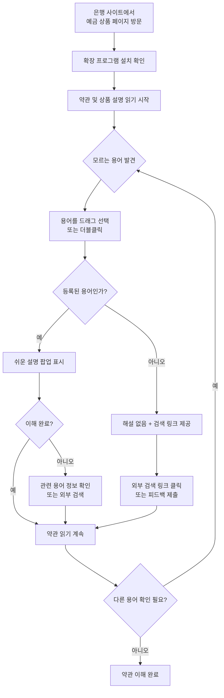

# 금융 용어 해설 서비스 MVP 기획안

> **"금융 용어 쉽게"** - 금융 약관을 읽는 과정에서 사용자가 선택한 전문용어를 즉시 해설해주는 문맥 기반 읽기 보조 서비스  
> **문서 버전**: v1.2 | **최종 수정일**: 2026-01-21 | **작성자**: judy0

## 📝 수정 이력

| 버전 | 수정일 | 주요 변경사항 |
|------|--------|--------------|
| v1.2 | 2026-01-21 | • **핵심 기획 방향 변경**: 자동 감지 방식에서 사용자 선택 기반 방식으로 전환<br>• 서비스 정의를 "문맥 기반 읽기 보조 서비스"로 명확화<br>• 문제 정의를 "읽기 흐름 중단" 중심으로 재작성<br>• MVP 범위에 사용자 선택 기반 동작 명시<br>• 기능 1을 "사용자 선택 텍스트 감지 및 해설 제공"으로 전면 수정<br>• 팝업 구조 변경: 관련 용어 클릭 기능 제거, 미등록 용어 처리 추가<br>• 사용자 시나리오를 선택 기반 흐름으로 변경<br>• 성공 지표를 선택 기반 지표로 조정<br>• 기술 스택 단순화 반영 |
| v1.1 | 2026-01-21 | • 핵심 가치 제안을 "약관 이해" 중심으로 명확화<br>• 타겟 페이지 섹션 추가 (로그인 전 페이지 집중)<br>• 시장 분석 섹션 추가<br>• 공통 페인 포인트에 금융 이해력 데이터 추가<br>• 사용자 시나리오를 약관 읽기 중심으로 수정<br>• 용어 사전 데이터 출처 섹션 추가<br>• 법적 리스크 분석 섹션 추가<br>• 성공 지표에 벤치마크 데이터 추가<br>• 수익 모델 섹션 추가 |
| v1.0 | 2026-01-21 | 최초 문서 작성 |

---

# 목차

1. [서비스 개요](#1-서비스-개요)
   - 1.1 [서비스 명](#11-서비스-명)
   - 1.2 [핵심 가치 제안](#12-핵심-가치-제안)
   - 1.3 [해결하고자 하는 문제](#13-해결하고자-하는-문제)
   - 1.4 [MVP 범위](#14-mvp-범위)
   - 1.5 [시장 분석](#15-시장-분석)
2. [타겟 사용자 및 페르소나](#2-타겟-사용자-및-페르소나)
3. [MVP 기능 정의 및 우선순위](#3-mvp-기능-정의-및-우선순위)
4. [사용자 경험 플로우](#4-사용자-경험-플로우)
5. [용어 사전 구성 계획](#5-용어-사전-구성-계획)
   - 5.6 [용어 사전 데이터 출처](#56-용어-사전-데이터-출처)
6. [법적/규제 준수](#6-법적규제-준수)
   - 6.7 [법적 리스크 분석](#67-법적-리스크-분석)
7. [콘텐츠 검증 프로세스](#7-콘텐츠-검증-프로세스)
8. [성공 지표 및 출시 전략](#8-성공-지표-및-출시-전략)
   - 8.5 [수익 모델](#85-수익-모델)
9. [향후 확장 로드맵](#9-향후-확장-로드맵)

---

# 1. 서비스 개요

## 1.1 서비스 명
**금융 용어 쉽게** (가칭)

## 1.2 핵심 가치 제안

금융 약관을 읽는 과정에서 사용자가 선택한 전문용어를 즉시 해설해주는 문맥 기반 읽기 보조 서비스

**주요 효과**
1. 약관 읽기 흐름을 끊지 않고 모르는 용어를 즉시 확인
2. 페이지 이탈 없이 맥락을 유지하며 약관 이해
3. 필요한 용어만 선택적으로 확인하여 효율적인 학습

**포지셔닝**
- 근본 목적: 약관 읽기 흐름 유지 + 용어 이해
- 사용자 주도: 자동이 아닌 사용자가 필요할 때 선택하는 방식
- 부가 효과: 상품 비교도 수월해짐

## 1.3 해결하고자 하는 문제

**근본 문제: 약관 읽기 중 흐름 중단**
- 금융 약관을 읽다가 모르는 전문용어가 나오면 읽기 흐름이 끊김
- 용어를 검색하기 위해 새 탭을 열거나 페이지를 벗어나야 함
- 검색 후 돌아오면 어디까지 읽었는지 맥락과 흐름이 상실됨
- 다시 찾아서 이어 읽기가 번거롭고, 집중력이 떨어짐

**추가 문제: 용어 이해의 어려움**
- 검색해도 설명이 여전히 어렵거나 광고성 콘텐츠가 많음
- 같은 개념도 은행마다 다르게 표현 (예: "복리식" vs "복리")
- 여러 은행의 약관을 비교할 때 용어 때문에 혼란 가중

**결과적 문제: 약관 이해 포기 또는 잘못된 의사결정**
- 용어를 이해하지 못하니 약관을 대충 넘기거나 읽기를 포기
- 용어를 오해하여 잘못된 상품 선택을 하는 경우 발생
- 금융 문맹으로 인한 소비자의 불안감과 의사결정 부담 증가

## 1.4 MVP 범위

### 금융 상품
- **예금**: 정기예금, 자유적립예금, 파킹통장
- **적금**: 정기적금, 자유적립식 적금

### 금융기관
- **시중은행**: KB국민, 신한, 하나, 우리, NH농협 등
- **인터넷은행**: 카카오뱅크, 토스뱅크, 케이뱅크
- **지방은행**: 부산, 대구, 광주, 경남, 전북 등
- **기타**: 새마을금고, 신협, 우체국

### 동작 방식 (핵심 변경사항)

**본 MVP는 자동 하이라이트가 아닌, 사용자가 읽는 중 선택한 금융 전문용어에 대해 즉시 해설을 제공하는 기능에 집중합니다.**

**사용자 동작**
- 드래그 선택: 모르는 용어를 마우스로 드래그하여 선택
- 더블클릭: 단어를 더블클릭하여 빠르게 선택

**시스템 반응**
- 선택된 텍스트가 등록된 용어인 경우: 즉시 해설 팝업 표시
- 선택된 텍스트가 등록되지 않은 경우: "해설을 찾을 수 없습니다 + 외부 검색 링크 제공" 표시

**MVP 방식 선택 이유**
1. **정확성 보장**: 사용자가 선택한 텍스트만 처리하여 오탐지 위험 제거
2. **기술적 단순성**: 페이지 전체 DOM 스캔 불필요, 개발 및 테스트 용이
3. **성능 최적화**: 페이지 로드 시 부하 없음, 사용자 요청 시에만 작동
4. **은행 사이트 호환성**: 사이트 구조에 무관하게 100% 작동 보장
5. **빠른 검증**: 핵심 가치(용어 해설)를 빠르게 테스트 가능

**향후 확장 (Phase 2)**
- 자동 하이라이트 기능 추가 (옵션으로 제공)
- 페이지 내 용어 미리 표시 (선택적 활성화)

### 타겟 페이지

본 서비스는 **약관 및 상품 설명을 읽을 수 있는 페이지**를 타겟으로 합니다.

**주요 타겟: 로그인 전 공개된 약관 및 상품 설명**
- 상품 소개 페이지의 상품 설명 및 주요 조건
  - 예: KB국민은행 정기예금 안내 페이지
- 웹에 공개된 약관 또는 상품설명서 페이지
- 금리 비교 페이지에 포함된 상품 조건 설명
- 고객센터의 상품 안내 및 FAQ

**향후 확장: 로그인 후 약관 페이지 (Phase 2)**
- 가입 진행 중 약관 동의 페이지
- 상세 약관 확인 화면
- (기술 검증 필요: 보안 정책에 따라 제약 가능)

**단계별 접근 이유**
- **Phase 1 (MVP)**: 기술적으로 안정적인 영역(로그인 전)에 집중
  - 보안 제약 없이 100% 작동 보장
  - 실제로 많은 사용자가 로그인 전에 약관/상품 설명 확인
  - 빠른 검증 및 피드백 수집
  
- **Phase 2**: 로그인 후 페이지 기술 검증 및 확대
  - 실제 은행별 보안 정책 테스트
  - 작동 가능한 영역 단계적 확장

**핵심 포지셔닝**
"약관 읽기 흐름을 끊지 않는 도구" → 결과적으로 "상품 이해 및 비교도 수월"

---

## 1.5 시장 분석

### 시장 규모 및 기회

**금융 상품 이용 현황**
- 국내 만 18세 이상 성인의 **99.8%**가 최소 1개 이상의 금융 상품 보유 (한국은행, 2024)
- 예금/적금 계좌 보유율: **95.2%** (전 연령대 평균)
- 연간 신규 예금/적금 가입: 약 **2,500만 건** (금융감독원, 2024)

**금융 이해력 현황**
- 한국인 금융 이해력 점수: **66.5점/100점** (OECD 평균 62.4점, 2023)
- 금융 용어 이해도 조사 결과 (금융감독원, 2023):
  - "복리"의 정확한 의미를 아는 비율: **42.3%**
  - "세전금리"와 "세후금리" 차이를 이해하는 비율: **38.7%**
  - "중도해지" 불이익을 정확히 아는 비율: **51.2%**

**온라인 금융 이용 증가**
- 인터넷뱅킹 이용률: **87.3%** (2024년 1분기 기준)
- 모바일뱅킹 이용률: **91.5%**
- 비대면 채널을 통한 예금/적금 가입 비율: **68.4%** (전년 대비 +12.3%p)
- 은행 창구 방문 없이 온라인으로만 상품 비교 후 가입하는 비율: **55.7%**

### 타겟 시장 추정

**1차 타겟 (적극 사용자)**
- 온라인으로 금융 상품을 비교하고 가입하는 성인: 약 **1,200만 명**
- 이 중 약관 이해에 어려움을 느끼는 비율: 약 **60%** (추정)
- **핵심 타겟: 약 720만 명**

**2차 타겟 (잠재 사용자)**
- 온라인 금융 이용자 중 약관을 대충 넘기는 사람들
- 금융 지식을 높이고 싶어하는 사람들
- **확장 타겟: 약 1,500만 명**

### 경쟁 환경

**직접 경쟁자**
- 현재 국내에는 **직접 경쟁 서비스 없음**
- 유사 서비스:
  - 네이버 금융 용어사전 (검색 기반, 페이지 이탈 필요)
  - 금융감독원 금융용어사전 (검색 기반)
  - 각 은행의 용어 설명 페이지 (산재되어 있음)

**차별점**
- ✅ 약관 읽는 맥락에서 즉시 확인 (페이지 이탈 불필요)
- ✅ 사용자 선택 기반으로 정확한 용어 해설 제공
- ✅ 쉬운 언어와 구체적 예시 중심
- ✅ 사용자의 학습 흐름을 끊지 않음

**간접 경쟁자**
- 포털사이트 검색
- ChatGPT 등 AI 챗봇
- 유튜브 금융 교육 콘텐츠

### 시장 진입 전략

**진입 장벽 낮음**
- 브라우저 확장 프로그램 형태로 설치 간편
- 무료 서비스로 진입 장벽 최소화
- 기존 금융기관과 경쟁 관계 아님 (협력 가능)

**성장 가능성**
- 금융 포용(Financial Inclusion) 정책 강화 추세
- 소비자 보호 및 불완전판매 방지 관심 증가
- 금융 교육 의무화 논의 활발
- 정부/금융기관의 지원 가능성

**예상 시장 점유율**
- 1년차 목표: 타겟 시장의 **0.1%** → 약 7,200명
- 3년차 목표: 타겟 시장의 **1%** → 약 72,000명
- 5년차 목표: 타겟 시장의 **5%** → 약 360,000명

---

# 2. 타겟 사용자 및 페르소나

## 2.1 주요 타겟
- **모든 연령대의 일반 소비자**
- 금융 상품 가입 시 약관을 꼼꼼히 읽고 싶지만 전문용어 때문에 어려움을 겪는 사람
- 예금/적금 상품 비교를 위해 여러 은행 사이트를 방문하는 사람

## 2.2 상세 페르소나

### 페르소나 1: 직장인 김지수 (32세)

**기본 정보**
- 직업: IT 기업 마케팅 팀 대리
- 거주지: 서울 강남구
- 연소득: 4,500만원
- 금융 자산: 약 2,000만원

**배경**  
입사 5년차로 첫 목돈을 모았습니다. 회사 근처 은행 지점을 몇 번 방문했지만, 직원이 권하는 상품을 그대로 가입하기엔 불안했습니다. 퇴근 후 집에서 여러 은행 홈페이지를 방문해 상품을 비교하려 하지만, 약관에 나오는 용어들이 낯설어 이해하는 데 시간이 오래 걸립니다.

**목표와 니즈**
- 🎯 여러 은행의 예금/적금 상품을 꼼꼼히 비교하고 싶음
- 🎯 은행 직원의 설명 없이도 스스로 이해하고 가입하고 싶음
- 🎯 금융 지식을 쌓아 더 나은 재테크를 하고 싶음

**페인 포인트**
- ❌ "만기일시지급식", "복리", "세전이율" 같은 용어를 매번 검색하느라 시간 소비
- ❌ 검색창으로 이동하면 어느 은행 페이지를 보고 있었는지 헷갈림
- ❌ 용어마다 설명이 너무 어렵거나 광고성 콘텐츠가 섞여 있음

---

### 페르소나 2: 대학생 이준호 (24세)

**기본 정보**
- 직업: 대학교 4학년 재학 중 + 편의점 아르바이트
- 거주지: 경기도 수원시 (자취)
- 월소득: 약 120만원 (용돈 50만원 + 알바 70만원)
- 금융 자산: 약 300만원

**배경**  
생활비를 빼고 남는 돈을 모으기 위해 적금을 시작하려고 합니다. 부모님이나 친구들에게 물어보기엔 금융 지식이 없다는 게 부끄럽습니다. 토스, 카카오뱅크 같은 앱은 익숙하지만, 정작 상품 설명을 읽으면 무슨 말인지 잘 모르겠습니다.

**목표와 니즈**
- 🎯 매달 20-30만원 정도 꾸준히 저축하고 싶음
- 🎯 금융 용어를 몰라도 쉽게 이해하고 가입하고 싶음
- 🎯 스스로 해결하는 능력을 키우고 싶음

**페인 포인트**
- ❌ 금융 기초 지식이 부족해서 약관이 외계어처럼 느껴짐
- ❌ 부모님께 물어보면 "은행 가서 물어봐"라는 답변만 돌아옴
- ❌ 검색해도 너무 어렵게 설명되어 있거나 광고만 나옴

---

### 페르소나 3: 은퇴자 박영희 (65세)

**기본 정보**
- 직업: 은퇴 (전 공무원)
- 거주지: 부산광역시
- 금융 자산: 약 2억원 (퇴직금 포함)

**배경**  
최근 퇴직하여 퇴직금을 안전하게 예금하려고 합니다. 과거 불완전판매로 손해를 본 경험이 있어, 이번에는 꼼꼼히 확인하고 가입하고 싶습니다. 하지만 최근 금융 용어들이 과거와 달라진 것 같고, 온라인 절차도 낯설어서 어렵습니다.

**목표와 니즈**
- 🎯 퇴직금을 안전하게 보관하고 이자 수익 얻고 싶음
- 🎯 손해 보지 않도록 약관을 정확히 이해하고 싶음
- 🎯 자녀에게 부담 주지 않고 스스로 해결하고 싶음

**페인 포인트**
- ❌ "중도해지이율", "이자소득세" 등이 예전과 달라져서 헷갈림
- ❌ 창구 직원이 빨리 설명해서 놓치는 내용이 많음
- ❌ 온라인으로 하려니 화면도 작고 용어도 어려움

---

### 페르소나 4: 프리랜서 최민지 (28세)

**기본 정보**
- 직업: 프리랜서 디자이너
- 거주지: 서울 홍대 인근
- 월소득: 불규칙 (평균 250만원)
- 금융 자산: 약 800만원

**배경**  
불규칙한 수입 때문에 비상금을 모으는 게 중요합니다. 자유입출금이 가능하면서도 이자를 받을 수 있는 상품을 찾고 있습니다. 여러 상품을 비교하다 보면 "CMA", "MMDA", "파킹통장" 등 비슷한 것 같으면서도 다른 용어들이 혼란스럽습니다.

**목표와 니즈**
- 🎯 자유롭게 입출금하면서도 이자 받을 수 있는 상품 찾기
- 🎯 여러 상품의 미묘한 차이를 정확히 이해하고 싶음
- 🎯 빠르게 비교하고 결정하고 싶음

**페인 포인트**
- ❌ CMA, MMDA, RP 등 약자가 많아서 무슨 뜻인지 모르겠음
- ❌ 비슷해 보이는 상품들의 차이를 파악하기 어려움
- ❌ 프리랜서 특성상 시간이 부족해서 빠른 결정 필요

---

## 2.3 공통 페인 포인트

모든 페르소나가 공통적으로 겪는 어려움:

1. **약관 이탈 문제**: 용어를 검색하려고 페이지를 벗어나면 맥락이 끊김
2. **시간 소비**: 용어 하나하나 검색하느라 상품 비교에 시간이 오래 걸림
3. **설명의 난이도**: 검색 결과가 여전히 어렵거나 광고성 콘텐츠
4. **비교의 어려움**: 여러 은행을 오가며 비교할 때 헷갈림

### 금융 이해력 현황 데이터

**한국 소비자의 금융 용어 이해도 (금융감독원, 2023)**

| 용어 | 정확한 의미를 아는 비율 | 대략 아는 비율 | 모르는 비율 |
|------|------------------------|---------------|------------|
| 복리 | 42.3% | 31.5% | 26.2% |
| 세전금리 vs 세후금리 | 38.7% | 28.9% | 32.4% |
| 중도해지 불이익 | 51.2% | 29.3% | 19.5% |
| 우대금리 조건 | 45.8% | 32.7% | 21.5% |
| 예금자보호 한도 | 67.3% | 19.8% | 12.9% |
| CMA vs MMDA | 23.4% | 18.7% | 57.9% |

**연령대별 금융 이해도 격차**
- 20대: 58.3점 (용어 이해도 낮지만 온라인 활용도 높음)
- 30대: 69.7점 (가장 높은 이해도)
- 40대: 68.4점
- 50대: 65.2점
- 60대 이상: 57.1점 (용어 이해도 낮고 온라인 활용도도 낮음)

**약관 읽기 행태 조사 (한국소비자원, 2024)**
- "약관을 끝까지 읽는다": **12.3%**
- "중요한 부분만 읽는다": **43.8%**
- "대충 훑어본다": **31.2%**
- "거의 읽지 않는다": **12.7%**

**약관을 제대로 읽지 않는 이유 (복수응답)**
1. 내용이 어렵고 이해하기 힘들어서: **68.4%** ⭐
2. 분량이 너무 많아서: **52.3%**
3. 시간이 없어서: **38.7%**
4. 어차피 다 비슷할 것 같아서: **24.5%**

→ **본 서비스가 해결할 핵심 문제: "내용이 어렵고 이해하기 힘들다" (68.4%)**

---

# 3. MVP 기능 정의 및 우선순위

## 3.1 MVP 목표
최소한의 기능으로 **"예금/적금 약관 읽기가 쉬워진다"**는 핵심 가치를 검증하고, 사용자 피드백을 빠르게 수집합니다.

## 3.2 MVP 성공 기준
- 30-50개 핵심 용어에 대한 즉시 해설 제공
- 주요 5개 은행 사이트에서 정상 작동
- 사용자 만족도 4.0/5.0 이상
- 첫 달 500명 이상 설치

## 3.3 핵심 기능 (Must-Have)

### 기능 1: 사용자 선택 텍스트 감지 및 해설 제공 ⭐⭐⭐⭐⭐
**우선순위**: 최우선 (P0)

**기능 설명**
- 사용자가 약관을 읽다가 모르는 용어를 드래그 선택 또는 더블클릭
- 선택된 텍스트가 등록된 용어 사전과 일치하는지 확인
- 일치하면 쉬운 설명 팝업을 즉시 표시
- 일치하지 않으면 "해설을 찾을 수 없습니다 + 검색 링크 제공"

**세부 요구사항**

**사용자 입력 방식**
- 드래그 선택: 모르는 용어를 마우스로 드래그하여 선택
- 더블클릭: 단어를 더블클릭하여 빠르게 선택
- 모바일: 텍스트 길게 누르기 또는 더블탭

**텍스트 매칭 로직**
- 선택 후 0.2초 이내에 용어 사전과 매칭 결과 반환
- 띄어쓰기 무시: "세전금리", "세전 금리" 모두 동일하게 인식
- 대소문자 무시: 영문 약자의 경우 대소문자 구분 없이 매칭
- 정확한 매칭 우선: 선택한 텍스트와 정확히 일치하는 용어 우선 검색

**일치하는 용어가 있을 때**
- 즉시 해설 팝업 표시
- 팝업 내용: 쉬운 설명, 예시, 관련 용어 (정보만)

**일치하는 용어가 없을 때**
- "해설을 찾을 수 없습니다" 메시지 팝업 표시
- 외부 검색 링크 제공:
  - 네이버 검색: `https://search.naver.com/search.naver?query=[선택한용어]+금융+용어`
  - 금융감독원 용어사전: `https://fine.fss.or.kr/`
- 사용자 피드백 버튼: "이 용어가 필요하신가요?" → 수집하여 향후 추가 검토

**성공 지표**
- 선택 후 팝업 표시 속도 0.2초 이내
- 용어 매칭 정확도 100% (선택 기반이므로 오탐지 없음)
- 사용자 1인당 평균 3-5개 용어 선택/조회

---

### 기능 2: 해설 팝업 표시 ⭐⭐⭐⭐⭐
**우선순위**: 최우선 (P0)

**기능 설명**
- 사용자가 선택한 용어에 대한 해설을 팝업으로 표시
- 등록된 용어인 경우와 미등록 용어인 경우를 구분하여 표시

**팝업 구성 (일치하는 용어)**
```
┌─────────────────────────────┐
│ [용어명]                     │
│                             │
│ [쉬운 말 설명]               │
│ (1-2문장)                   │
│                             │
│ 💡 예시                     │
│ [구체적 숫자 예시]           │
│                             │
│ 🔗 관련 용어 (정보만)       │
│ • 복리 • 단리               │
│ (클릭 불가, 정보 제공용)    │
│                             │
│ ※ 본 설명은 참고용이며,     │
│ 정확한 정보는 해당 금융기관에│
│ 확인하세요.                 │
│                             │
│        [닫기 버튼]           │
└─────────────────────────────┘
```

**팝업 구성 (일치하지 않는 용어)**
```
┌─────────────────────────────┐
│ 해설을 찾을 수 없습니다      │
│                             │
│ "[선택한 텍스트]"에 대한    │
│ 해설이 등록되지 않았습니다. │
│                             │
│ 🔍 다른 곳에서 검색하기     │
│ • 네이버 검색               │
│ • 금융감독원 금융용어사전   │
│                             │
│ [이 용어가 필요하신가요?]   │
│                             │
│        [닫기 버튼]           │
└─────────────────────────────┘
```

**세부 요구사항**

**PC 환경**
- 팝업 위치: 선택한 텍스트 바로 위 또는 아래
- 화면 밖으로 나가지 않도록 자동 위치 조정
- ESC 키 또는 팝업 밖 클릭으로 닫기
- 팝업 내 텍스트 선택 가능 (복사 가능)

**모바일 환경**
- 화면 중앙에 표시 (선택한 위치와 무관)
- 팝업 외부 터치 시 닫힘
- 화면 크기에 맞게 팝업 크기 자동 조정

**관련 용어 처리**
- 클릭 기능 없음 (정보만 제공)
- 텍스트로만 표시
- 향후 Phase 2에서 클릭 기능 추가 검토

**성공 지표**
- 팝업 표시 속도 0.2초 이내
- 팝업 가독성 만족도 4.5/5.0 이상
- 외부 검색 링크 클릭률 (미등록 용어 대응 효과성 측정)

---

### 기능 3: 확장 프로그램 ON/OFF 토글 ⭐⭐⭐⭐
**우선순위**: 높음 (P1)

**기능 설명**
- 브라우저 툴바의 확장 프로그램 아이콘 클릭 시 기능 활성화/비활성화
- 현재 활성 상태 표시

**세부 요구사항**
- ON/OFF 상태 시각적 구분 (색상 변화 또는 아이콘 변경)
- 상태는 탭별로 독립적으로 관리
- 설정은 브라우저 저장소에 저장 (재방문 시 유지)
- OFF 상태에서는 텍스트 선택 이벤트 감지 안 함

---

### 기능 4: 기본 설정 메뉴 ⭐⭐⭐
**우선순위**: 중간 (P2)

**포함 설정 항목**
- 자동 활성화 ON/OFF (기본: ON)
- 팝업 스타일 선택 (기본/간소/상세)
- 팝업 크기 조정
- 통계 수집 동의 (선택, 기본: OFF)

---

## 3.4 부가 기능 (Nice-to-Have)

### 기능 5: 상품 비교 메모 기능 ⭐⭐
**우선순위**: 낮음 (P3)

**기능 설명**
- 여러 은행 사이트를 방문하며 상품을 비교할 때 도움을 주는 기능
- 각 은행 페이지별로 간단한 텍스트 메모 작성
- 메모 목록 보기 기능

**성공 지표**
- 메모 작성 사용자 비율 5% 이상

---

## 3.5 MVP 제외 기능 (Post-MVP)

다음 기능들은 Phase 2 이후로 미룹니다:

1. **자동 하이라이트 기능** → Phase 2 (옵션으로 제공)
2. **용어 북마크/저장 기능** → Phase 2 (학습 기능과 함께)
3. **용어 학습/퀴즈 기능** → Phase 2
4. **용어 조회 히스토리** → Phase 2
5. **AI 기반 맞춤 설명** → Phase 3
6. **약관 전체 요약 기능** → Phase 3
7. **상품 추천 기능** → Phase 4 (신중 검토)

---

# 4. 사용자 경험 플로우

## 4.1 전체 사용 시나리오



## 4.2 주요 인터랙션

### 확장 프로그램 설치 직후
- 간단한 온보딩: 서비스 소개 + 사용법 (3페이지 이내)
- 핵심 기능 안내: "드래그 또는 더블클릭으로 용어를 선택하세요"
- 권장 사용 사이트 안내

### 금융 사이트 방문 시
- 별도의 페이지 로드 처리 없음 (사용자 선택 기반이므로)
- 툴바 아이콘이 활성 상태 표시
- 사용자가 텍스트를 선택할 때까지 대기

### 용어 선택 및 조회
- 드래그 선택 완료 시 즉시 처리
- 더블클릭 시 단어 경계 자동 인식
- 0.2초 이내에 팝업 표시
- ESC 키 또는 팝업 밖 클릭으로 닫기

## 4.3 사용 시나리오 예시

### 김지수의 하루 (서비스 사용 후)

1. 퇴근 후 집에서 여러 은행의 예금 상품을 알아보기 위해 검색
2. KB국민은행 정기예금 상품 페이지 방문 (로그인 전)
3. 상품 설명 및 약관 읽기 시작
   - "세전금리 3.5%, 복리 적용, 만기일시지급식" 확인
4. **"세전금리"라는 용어가 이해되지 않음**
5. **"세전금리"를 드래그 선택** (또는 더블클릭)
6. **즉시 팝업으로 쉬운 설명 표시**
   - "세전금리: 세금을 떼기 전의 금리입니다..."
   - 예시: "3.5% 세전금리라면 실제로는 세후 약 2.8%를 받게 됩니다"
7. 팝업을 닫고 약관 읽기 계속
8. 다시 "복리"라는 용어가 나옴
9. **"복리"를 더블클릭하여 빠르게 확인**
   - "복리: 이자에도 이자가 붙는 방식..."
10. "만기일시지급식"도 같은 방식으로 확인
11. 약관과 조건을 정확히 이해하며 KB 상품 파악 완료
12. 신한은행 페이지로 이동, 동일한 방식으로 필요한 용어만 선택적으로 확인
13. 하나은행, 우리은행도 방문
    - 각 은행에서 모르는 용어만 선택적으로 확인
    - 페이지 이탈 없이 읽기 흐름 유지
14. 30분 만에 4개 은행 약관 이해 및 상품 비교 완료
15. KB국민은행 선택 결정, 다음날 가입

**핵심 가치 입증**
- 약관 읽기 흐름이 끊기지 않음 (근본 목적) ✅
- 필요한 용어만 선택적으로 확인하여 효율적 (사용자 주도) ✅
- 결과적으로 상품 비교도 수월해짐 (부가 효과) ✅

**기존 방식과 비교**

| 항목 | 기존 방식 | 본 서비스 사용 |
|------|----------|---------------|
| 용어 확인 방법 | 새 탭 열어 검색 | 드래그/더블클릭 |
| 페이지 이탈 | 매번 발생 | 없음 |
| 시간 소요 | 용어당 1-2분 | 용어당 5-10초 |
| 맥락 유지 | 어려움 | 쉬움 |
| 흐름 | 계속 끊김 | 매끄러움 |

---

# 5. 용어 사전 구성 계획

## 5.1 MVP 용어 범위

### 목표
**30-50개의 핵심 금융 용어**를 선정하여 예금/적금 상품 약관 이해도를 80% 이상 높입니다.

### 선정 기준
1. **빈도**: 대부분의 예금/적금 약관에 등장하는 용어
2. **중요도**: 상품 선택과 수익에 직접적인 영향을 미치는 용어
3. **난이도**: 일반 소비자가 이해하기 어려운 전문 용어
4. **혼동성**: 비슷한 용어와 혼동하기 쉬운 용어

## 5.2 용어 카테고리 및 리스트

### 1. 금리 관련 (10개)

| 용어 | 우선순위 | 선정 이유 |
|------|---------|----------|
| 연이율 | 필수 | 가장 기본적인 금리 표시 단위 |
| 월이율 | 필수 | 연이율과 혼동하기 쉬움 |
| 단리 | 필수 | 복리와의 차이 이해 필수 |
| 복리 | 필수 | 수익률에 큰 영향, 이해 어려움 |
| 세전금리 | 필수 | 실수령액 계산에 필수 |
| 세후금리 | 필수 | 실제 수익률 이해에 필수 |
| 우대금리 | 필수 | 조건 이해가 중요함 |
| 기본금리 | 권장 | 우대금리와 구분 필요 |
| 실질금리 | 권장 | 물가를 고려한 실제 수익 |
| 명목금리 | 선택 | 실질금리와의 차이 |

### 2. 상품 구조 (12개)

| 용어 | 우선순위 | 선정 이유 |
|------|---------|----------|
| 만기일시지급식 | 필수 | 가장 흔한 지급 방식 |
| 월지급식 | 필수 | 만기일시지급과 비교 필요 |
| 정기예금 | 필수 | 기본 상품 유형 |
| 정기적금 | 필수 | 예금과 혼동 방지 |
| 자유적립식 | 필수 | 정액적립과 구분 |
| 정액적립식 | 필수 | 납입 방식 이해 |
| 거치식 | 권장 | 이자 계산 방식 |
| 적립식 | 권장 | 거치식과 비교 |
| 중도해지 | 필수 | 불이익 이해 필수 |
| 만기 | 필수 | 기본 개념 |
| 자동연장 | 권장 | 만기 후 처리 방식 |
| 자동해지 | 권장 | 자동연장과 구분 |

### 3. 세금 및 비용 (10개)

| 용어 | 우선순위 | 선정 이유 |
|------|---------|----------|
| 이자소득세 | 필수 | 실수령액 계산 필수 |
| 지방소득세 | 필수 | 이자소득세와 함께 부과 |
| 원천징수 | 필수 | 세금 처리 방식 |
| 비과세 | 필수 | 세금 혜택 이해 |
| 세금우대 | 필수 | 비과세와 구분 |
| 금융소득종합과세 | 권장 | 고액 자산가에게 중요 |
| 과세표준 | 선택 | 세금 계산 기초 |
| 분리과세 | 선택 | 종합과세와 구분 |
| 농어촌특별세 | 선택 | 비과세 상품 관련 |
| 소득공제 | 선택 | 연말정산 관련 |

### 4. 예금 보호 (6개)

| 용어 | 우선순위 | 선정 이유 |
|------|---------|----------|
| 예금자보호법 | 필수 | 안전성 이해 필수 |
| 예금보험공사 | 필수 | 보호 주체 |
| 보호한도 | 필수 | 5천만원 한도 이해 |
| 원금 | 필수 | 기본 개념 |
| 이자 | 필수 | 기본 개념 |
| 1인당 5천만원 | 권장 | 보호한도 구체화 |

### 5. 특수 상품 및 기타 (12개)

| 용어 | 우선순위 | 선정 이유 |
|------|---------|----------|
| CMA | 필수 | 자주 보는 약자, 혼동 많음 |
| MMDA | 필수 | CMA와 유사하여 혼동 |
| RP (환매조건부채권) | 권장 | 단기 상품 이해 |
| 파킹통장 | 필수 | 유행하는 용어 |
| 입출금자유예금 | 필수 | 기본 상품 유형 |
| 요구불예금 | 권장 | 정기예금과 구분 |
| 저축예금 | 권장 | 일반 예금과 구분 |
| 보통예금 | 권장 | 가장 기본 상품 |
| 기업자유예금 | 선택 | 기업용 상품 |
| 장단기차익 | 선택 | 금융 상품 이해 |
| CD (양도성예금증서) | 선택 | 특수 상품 |
| 정기예탁금 | 선택 | 신협 등에서 사용 |

## 5.3 용어 설명 작성 가이드

### 기본 구조

각 용어는 다음 구조로 작성합니다:

```markdown
### [용어명]

**쉬운 말 설명**
- 초등학생도 이해할 수 있는 수준의 쉬운 표현 (1-2문장)

**구체적 예시**
- 숫자를 사용한 실생활 예시

**왜 중요한가요?**
- 이 용어가 상품 선택이나 수익에 미치는 영향

**관련 용어**
- 함께 알아두면 좋은 용어 (2-3개)
```

### 작성 원칙

1. **쉬운 언어**: 중학생 수준에서 이해 가능한 표현
2. **구체적 예시**: 추상적 개념은 반드시 숫자 예시 포함
3. **비교 설명**: 유사 용어와의 차이점 명확히 제시
4. **실용성**: "이 용어가 왜 중요한지, 어떤 영향을 미치는지" 포함

## 5.4 용어 설명 예시

### 예시 1: 복리

**쉬운 말 설명**  
복리는 이자에도 이자가 붙는 방식이에요. 마치 눈덩이가 굴러가면서 점점 커지는 것처럼, 시간이 지날수록 받는 이자가 점점 많아집니다.

**구체적 예시**  
100만원을 연 3% 복리로 2년간 예금한다면:
- 1년 후: 100만원 + 3만원(이자) = 103만원
- 2년 후: 103만원 + 3만 900원(이자) = 106만 900원

같은 조건으로 단리로 예금하면 106만원이므로, 복리가 900원 더 유리해요. 기간이 길수록, 금액이 클수록 차이는 더 커집니다.

**왜 중요한가요?**  
같은 금리라도 복리로 계산하면 단리보다 수익이 많아요. 장기 예금일수록 복리 상품을 선택하는 것이 유리합니다.

**관련 용어**  
- 단리: 원금에만 이자가 붙는 방식
- 연이율: 1년 동안의 이자율
- 만기일시지급식: 복리 효과를 최대화할 수 있는 지급 방식

---

### 예시 2: 우대금리

**쉬운 말 설명**  
우대금리는 특정 조건을 충족하면 기본 금리에 더해서 받는 추가 금리예요. 은행이 정한 미션을 완료하면 보너스 금리를 주는 것이라고 생각하면 됩니다.

**구체적 예시**  
기본금리 3%인 예금 상품에서:
- 급여이체 시: +0.3%
- 자동이체 3건 이상: +0.2%
- 신규 고객: +0.5%

→ 모든 조건을 충족하면 총 4.0%의 금리를 받을 수 있어요.

**왜 중요한가요?**  
광고에 보이는 "최고 금리"는 보통 모든 우대 조건을 충족했을 때의 금리예요. 본인이 실제로 충족할 수 있는 조건을 확인하고, 실제 받을 금리를 계산하는 것이 중요합니다.

**관련 용어**  
- 기본금리: 조건 없이 받는 기본 이자율
- 연이율: 1년 동안의 이자율
- 세전금리: 세금을 떼기 전의 금리

---

### 예시 3: 중도해지

**쉬운 말 설명**  
중도해지는 예금이나 적금의 약속 기간이 끝나기 전에 미리 해지하는 것이에요. 급하게 돈이 필요할 때 찾을 수 있지만, 원래 약속한 이자보다 적게 받게 됩니다.

**구체적 예시**  
1년 만기 연 3% 적금에 100만원을 넣었는데, 6개월 만에 해지한다면:
- 원래 받을 이자: 약 1만 5천원
- 중도해지 이자 (1% 적용): 약 5천원
- 손해: 약 1만원

**왜 중요한가요?**  
중도해지하면 이자를 거의 못 받거나 예상보다 훨씬 적게 받아요. 예금이나 적금을 가입하기 전에, 중간에 돈을 꺼낼 일이 없는지 신중하게 생각해야 합니다.

**관련 용어**  
- 만기: 예금/적금 계약 기간이 끝나는 시점
- 중도해지이율: 중도해지 시 적용되는 낮은 이자율
- 약정이율: 원래 약속한 이자율

## 5.5 용어 작성 체크리스트

각 용어를 작성할 때 다음 항목을 확인합니다:

- [ ] 쉬운 말 설명이 2-3문장 이내로 명확한가?
- [ ] 중학생이 읽어도 이해할 수 있는 수준인가?
- [ ] 구체적인 숫자 예시가 포함되어 있는가?
- [ ] 실생활과 연결된 예시인가?
- [ ] 왜 중요한지 설명되어 있는가?
- [ ] 비슷한 용어와의 차이가 명확한가?
- [ ] 관련 용어 링크가 2-3개 포함되어 있는가?
- [ ] 전문가가 검수했는가?

---

## 5.6 용어 사전 데이터 출처

(내용은 2차 기획안과 동일하므로 생략 - 변경 없음)

---

# 6. 법적/규제 준수

## 6.1 서비스 법적 성격

### 정보 제공 서비스
본 서비스는 **금융 상품 판매나 중개가 아닌**, 금융 용어에 대한 **참고 정보를 제공하는 교육적 도구**입니다.

- ✅ 용어 설명 및 해설 제공
- ✅ 일반적인 금융 지식 전달
- ❌ 특정 상품 추천이나 권유
- ❌ 투자 자문이나 금융 상담

## 6.2 면책 조항 (Disclaimer)

### 서비스 내 명시 위치

면책 조항은 다음 위치에 명확히 표시됩니다:

1. **확장 프로그램 설치 페이지**: Chrome 웹 스토어 설명란에 명시
2. **첫 설치 후 온보딩 화면**: 사용자가 처음 서비스를 사용할 때 반드시 확인
3. **각 용어 팝업 하단**: 모든 용어 설명 팝업 하단에 간략히 표시
4. **설정 메뉴 내 '이용약관' 섹션**: 전체 이용약관 및 면책 조항 확인 가능

### 면책 조항 문구

#### 팝업 내 간략 버전
```
※ 본 설명은 참고용이며, 정확한 정보는 해당 금융기관에 확인하세요.
```

#### 온보딩/이용약관 상세 버전
```
【면책 조항】

1. 정보의 정확성
   본 서비스에서 제공하는 금융 용어 설명은 일반적인 참고 정보이며,
   법적 효력이나 구속력을 갖지 않습니다. 정확한 정보는 해당 금융기관 
   또는 금융감독원에 문의하시기 바랍니다.

2. 책임의 한계
   본 서비스의 정보를 활용하여 발생한 어떠한 손해에 대해서도 
   서비스 제공자는 법적 책임을 지지 않습니다.

3. 금융 상품 가입
   실제 금융 상품 가입 시에는 반드시 해당 금융기관의 공식 약관을
   확인하시고, 필요시 전문가의 상담을 받으시기 바랍니다.

4. 정보의 최신성
   금융 관련 법규와 용어는 수시로 변경될 수 있으며, 본 서비스는
   최신 정보 반영에 시간이 소요될 수 있습니다.

5. 제3자 웹사이트
   본 서비스는 제3자 웹사이트(은행 등)에서 작동하며, 해당 웹사이트의
   내용에 대해서는 책임을 지지 않습니다.
```

## 6.3 개인정보 처리 방침

(내용은 2차 기획안과 동일 - 변경 없음)

## 6.4 관련 법규 준수

(내용은 2차 기획안과 동일 - 변경 없음)

## 6.5 리스크 관리 방안

(내용은 2차 기획안과 동일 - 변경 없음)

## 6.6 출시 전 법적 검토 체크리스트

(내용은 2차 기획안과 동일 - 변경 없음)

## 6.7 법적 리스크 분석

(내용은 2차 기획안과 동일 - 변경 없음)

---

# 7. 콘텐츠 검증 프로세스

(내용은 2차 기획안과 동일 - 변경 없음)

---

# 8. 성공 지표 및 출시 전략

## 8.1 성공 지표 (KPI)

### 정량적 지표

**사용자 확보**
- 첫 달 목표: 500명 설치
- 3개월 목표: 5,000명 설치

**사용자 활성도**
- DAU (Daily Active Users): 설치자의 20% 이상
- 평균 세션당 용어 조회 수: 3-5개
- 텍스트 선택 후 팝업 표시 성공률: 95% 이상

**만족도**
- 확장 프로그램 스토어 평점: 4.5점 이상
- 리뷰 중 "도움이 되었다" 언급 비율: 80% 이상

### 정성적 지표

- 사용자 인터뷰를 통한 만족도 평가
- "약관 이해도가 향상되었다" 응답 비율
- "다른 사람에게 추천하겠다" (NPS) 점수

### v1.2 변경사항: 선택 기반 지표 추가

**선택 기반 측정 지표**
- 사용자 1인당 평균 텍스트 선택 횟수
- 등록된 용어 선택 비율 vs 미등록 용어 선택 비율
- 외부 검색 링크 클릭률 (미등록 용어 처리 효과성)
- 텍스트 선택 후 팝업 표시 지연 시간 (목표: 0.2초 이내)

**기존 지표 제거**
- ❌ 등록된 용어의 95% 이상 정확히 감지 (자동 감지 없음)
- ❌ 오탐지율 5% 이하 (사용자 선택 기반이므로 해당 없음)

### 벤치마크 데이터

(내용은 2차 기획안과 동일 - 변경 없음)

---

## 8.2 출시 전략

(내용은 2차 기획안과 동일 - 변경 없음)

## 8.3 개발 단계별 체크리스트

### v1.2 변경사항: 단순화된 개발 프로세스

**Phase 1: 핵심 기능 구현 (3주)**

**Week 1: 기반 구축**
- [ ] 확장 프로그램 기본 구조 생성
- [ ] 용어 사전 데이터 구조 설계
- [ ] 30개 핵심 용어 작성 및 검수

**Week 2: 선택 감지 및 매칭 기능**
- [ ] 텍스트 선택 이벤트 감지 (Selection API)
- [ ] 용어 사전 매칭 로직 구현
- [ ] 5개 주요 은행 사이트 테스트

**Week 3: 팝업 기능 및 마무리**
- [ ] 팝업 UI 디자인 및 구현 (일치/미일치 두 가지)
- [ ] 외부 검색 링크 기능
- [ ] ON/OFF 토글 및 설정 메뉴
- [ ] 버그 수정 및 최적화

**Phase 2: 베타 테스트 (2주)**
- (내용 동일)

**Phase 3: 런칭 (1주)**
- (내용 동일)

---

## 8.4 MVP 완성도 체크리스트

### v1.2 변경사항

**기능 완성도**
- [ ] 30개 이상 용어 등록 및 검수 완료
- [ ] 5개 주요 은행 사이트에서 정상 작동
- [ ] 텍스트 선택 (드래그/더블클릭) 정상 작동
- [ ] 등록 용어 매칭 정확도 100%
- [ ] 미등록 용어 처리 (외부 검색 링크) 정상 작동
- [ ] PC/모바일 모두 지원
- [ ] 설정 저장/불러오기 정상 동작

**성능 확인**
- [ ] 텍스트 선택 후 팝업 표시 0.2초 이내
- [ ] 페이지 로드 시 성능 영향 없음
- [ ] 메모리 사용량 적정 수준

---

## 8.5 수익 모델

(내용은 2차 기획안과 동일 - 변경 없음)

---

# 9. 향후 확장 로드맵

## 9.1 단계별 확장 계획

### Phase 1 (MVP) - 현재
- 예금/적금 상품 지원
- 30-50개 핵심 용어
- **사용자 선택 기반 해설 제공**
- 브라우저 확장 프로그램

### Phase 2 (3개월 후) - 자동 기능 추가
- **자동 하이라이트 기능 추가 (옵션으로 제공)**
- 용어 북마크/저장 기능
- 조회 히스토리
- 간단한 퀴즈 기능
- 용어 100개로 확장

### Phase 3 (6개월 후) - 상품 범위 확장
- 대출 상품 지원
- 보험 상품 지원 (일부)
- AI 기반 설명
- 용어 200개로 확장

### Phase 4 (12개월 후) - 플랫폼 확장
- 모바일 앱 (iOS/Android)
- 투자 상품 지원
- 개인화된 학습 경로
- 커뮤니티 기능

## 9.2 추가 기능 아이디어

- **AI 챗봇**: 용어뿐만 아니라 약관 전체 내용에 대한 Q&A
- **상품 추천**: 사용자의 조회 패턴을 분석하여 맞춤 상품 추천
- **약관 요약**: 긴 약관을 핵심만 추려서 요약
- **용어 퀴즈**: 게이미피케이션을 통한 금융 지식 향상
- **커뮤니티**: 용어나 상품에 대한 사용자 간 질문/답변

---

# 부록: 기획 산출물 체크리스트

## 완료된 항목
- [x] 서비스 개요 및 핵심 가치
- [x] 타겟 사용자 및 페르소나 (4명)
- [x] MVP 기능 정의 및 우선순위
- [x] 사용자 경험 플로우
- [x] 대상 금융기관 및 범위
- [x] 용어 사전 구성 계획 (30-50개)
- [x] 법적/규제 준수 방안
- [x] 콘텐츠 검증 프로세스 (금융 전문가 + 금융소비자원)
- [x] 성공 지표 (KPI)
- [x] 출시 전략
- [x] 향후 확장 가능성

## v1.2에서 변경된 주요 사항
- [x] 서비스 정의: 자동 감지 → 사용자 선택 기반
- [x] 문제 정의: 용어 이해 → 읽기 흐름 중단
- [x] MVP 동작 방식: 페이지 스캔 → 텍스트 선택 감지
- [x] 기능 1: 자동 하이라이트 → 선택 기반 해설
- [x] 팝업 구조: 관련 용어 클릭 제거, 미등록 용어 처리 추가
- [x] 사용자 시나리오: 자동 → 선택 기반
- [x] 성공 지표: 감지율/오탐지 → 선택 기반 지표

## 다음 단계 (별도 작성 예정)
- [x] 와이어프레임 → [완료: wireframe 문서 보기](wireframes/wireframe_금융용어해설서비스.md)
- [x] 디자인 가이드 → [완료: 디자인_가이드_금융용어해설서비스.md]

---

**문서 종료**

---

**v1.2 핵심 변경 요약**

본 문서(v1.2)는 기존 "자동 감지 및 하이라이트" 방식에서 **"사용자 선택 기반 해설 제공"** 방식으로 MVP 기획을 전환한 버전입니다.

**주요 변경 이유:**
1. 정확성 보장: 오탐지 위험 제거
2. 기술적 단순성: 개발 및 테스트 용이
3. 성능 최적화: 페이지 로드 부하 없음
4. 사이트 호환성: 100% 작동 보장
5. 빠른 검증: 핵심 가치 신속 테스트

**Phase 2에서 자동 하이라이트 기능을 옵션으로 추가할 예정입니다.**
