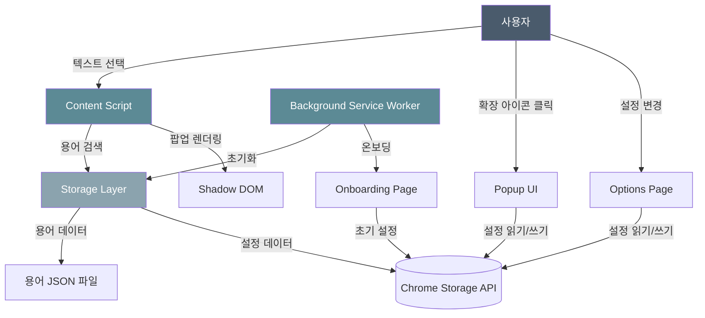
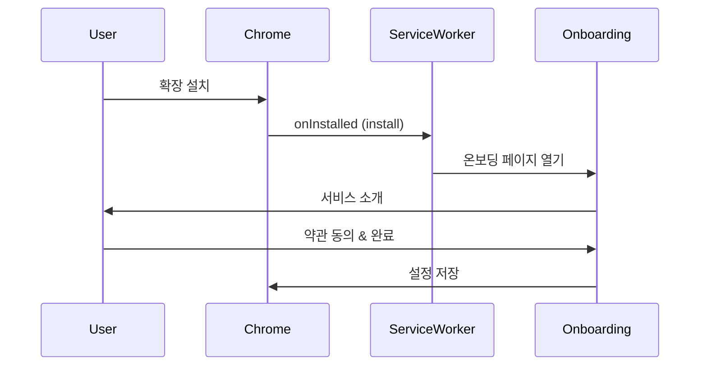
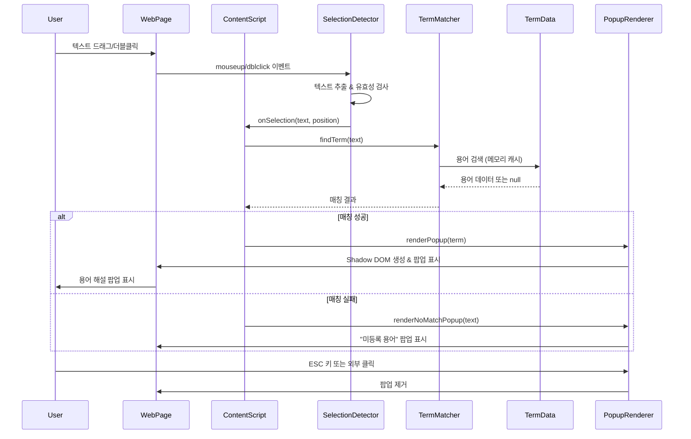
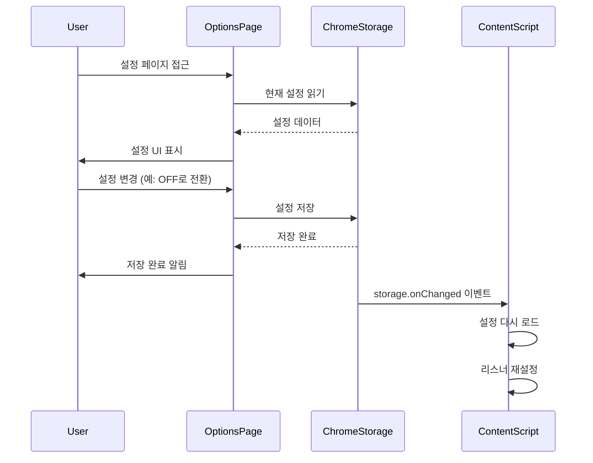
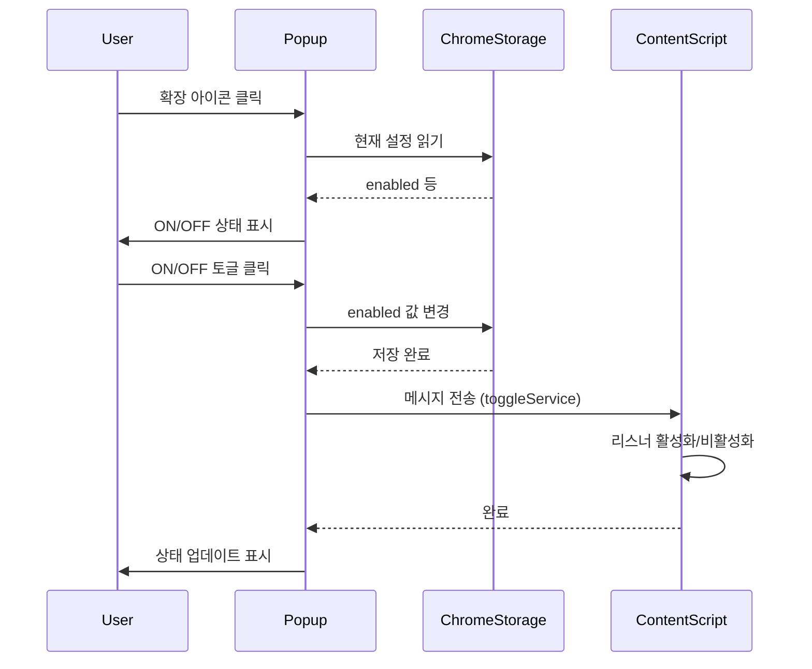

# 코드 아키텍처 문서

> 금융 용어 해설 Chrome 확장 프로그램의 기술 아키텍처 상세 문서

**작성일**: 2026-01-22  
**버전**: 1.0.0  
**대상**: Chrome Extension (Manifest V3) - MVP (Load Unpacked)

---

## 📋 목차

1. [아키텍처 개요](#아키텍처-개요)
2. [기술 스택](#기술-스택)
3. [시스템 구조](#시스템-구조)
4. [폴더 구조](#폴더-구조)
5. [데이터 구조](#데이터-구조)
6. [핵심 모듈](#핵심-모듈)
7. [상호작용 흐름](#상호작용-흐름)
8. [성능 최적화](#성능-최적화)
9. [보안 및 권한](#보안-및-권한)
10. [빌드 및 배포](#빌드-및-배포)

---

## 아키텍처 개요

### 설계 원칙

1. **비침습성 (Non-Intrusive)**
   - 웹 페이지의 기존 기능을 방해하지 않음
   - Shadow DOM으로 스타일 격리
   - 최소한의 DOM 조작

2. **성능 우선 (Performance First)**
   - 디바운싱으로 불필요한 이벤트 처리 최소화
   - 메모리 캐싱으로 빠른 용어 검색
   - 지연 로딩 (Lazy Loading) 적용

3. **사용자 중심 (User-Centric)**
   - 사용자 선택 기반 (자동 감지 제외)
   - 명확한 ON/OFF 제어
   - 접근성 고려 (ARIA, 키보드 네비게이션)

4. **확장 가능성 (Scalability)**
   - 모듈화된 코드 구조
   - 데이터와 로직 분리
   - 용어 추가/수정 용이

### 아키텍처 다이어그램



---

## 기술 스택

### Core Technologies

| 기술 | 버전 | 용도 |
|------|------|------|
| **Chrome Extension Manifest** | V3 | 확장 프로그램 표준 |
| **JavaScript** | ES2022+ | 로직 구현 |
| **HTML5** | - | UI 구조 |
| **CSS3** | - | 스타일링 |

### Storage & Data

| 기술 | 용도 | 특징 |
|------|------|------|
| **JSON 파일** | 용어 사전 저장 | - 30-50개 MVP 용어 저장<br>- 정적 데이터<br>- 메모리 로딩 |
| **Chrome Storage API** | 사용자 설정 | - `chrome.storage.sync` 사용<br>- 기기 간 동기화 |

### Development Tools

| 도구 | 버전 | 용도 |
|------|------|------|
| **Node.js** | 20.x LTS | 개발 환경 |
| **Vite** | 5.x | 번들러 & 개발 서버 |
| **ESLint** | 9.x | 코드 품질 검사 |
| **Prettier** | 3.x | 코드 포맷팅 |

### Fonts

| 폰트 | 용도 |
|------|------|
| **Pretendard** | 한글 텍스트 (본고딕 기반) |
| **Inter** | 영문/숫자 (가독성 최적화) |

---

## 시스템 구조

### Chrome Extension 구성 요소

```
┌─────────────────────────────────────────┐
│         Chrome Extension                │
├─────────────────────────────────────────┤
│                                         │
│  ┌─────────────────────────────────┐   │
│  │  Background Service Worker      │   │
│  │  - 확장 생명주기 관리           │   │
│  │  - 용어 데이터 로딩             │   │
│  │  - 메시지 라우팅                │   │
│  └─────────────────────────────────┘   │
│                                         │
│  ┌─────────────────────────────────┐   │
│  │  Content Script                 │   │
│  │  - 웹 페이지에 주입             │   │
│  │  - 텍스트 선택 감지             │   │
│  │  - 팝업 렌더링                  │   │
│  └─────────────────────────────────┘   │
│                                         │
│  ┌─────────────────────────────────┐   │
│  │  UI Components                  │   │
│  │  - Popup (툴바 아이콘)          │   │
│  │  - Options (설정 페이지)        │   │
│  │  - Onboarding (첫 실행)         │   │
│  └─────────────────────────────────┘   │
│                                         │
└─────────────────────────────────────────┘
```

### 레이어 구조

```
┌──────────────────────────┐
│    Presentation Layer    │  ← UI Components (Popup, Options, Onboarding)
├──────────────────────────┤
│    Application Layer     │  ← Content Script, Event Handlers
├──────────────────────────┤
│     Business Layer       │  ← Term Matcher, Selection Detector
├──────────────────────────┤
│      Data Layer          │  ← Storage Utils (Chrome Storage)
└──────────────────────────┘
```

---

## 폴더 구조

### 전체 구조

```
financial-project/
├── manifest.json              # 확장 메타데이터 & 권한
├── package.json               # 프로젝트 의존성
├── vite.config.js            # 빌드 설정
├── README.md                  # 프로젝트 소개
│
├── src/                       # 소스 코드
│   ├── background/           # Background Service Worker
│   ├── content/              # Content Scripts
│   ├── popup/                # 툴바 팝업
│   ├── options/              # 설정 페이지
│   ├── onboarding/           # 온보딩 페이지
│   ├── utils/                # 유틸리티
│   ├── data/                 # 용어 데이터
│   └── styles/               # 공통 스타일
│
├── assets/                    # 정적 자산
│   └── icons/                # 확장 아이콘
│
├── docs/                      # 문서
│   ├── 금융_용어_해설서비스_기획안_3차.md
│   ├── wireframes/
│   ├── 디자인_가이드_금융용어해설서비스_2차.md
│   └── 코드_아키텍처.md       # 본 문서
│
└── dist/                      # 빌드 출력 (생성됨)
```

### src/ 상세 구조

```
src/
├── background/
│   └── service-worker.js                # ★ 백그라운드 워커
│
├── content/
│   ├── content-script.js                # ★ 메인 콘텐츠 스크립트
│   ├── selection-detector.js            # 텍스트 선택 감지
│   ├── popup-renderer.js                # 팝업 렌더링
│   └── content-style.css                # 콘텐츠 스크립트 스타일
│
├── popup/
│   ├── popup.html                       # 팝업 HTML
│   ├── popup.js                         # 팝업 로직
│   └── popup.css                        # 팝업 스타일
│
├── options/
│   ├── options.html                     # 설정 페이지 HTML
│   ├── options.js                       # 설정 로직
│   └── options.css                      # 설정 스타일
│
├── onboarding/
│   ├── onboarding.html                  # 온보딩 HTML
│   ├── onboarding.js                    # 온보딩 로직
│   └── onboarding.css                   # 온보딩 스타일
│
├── utils/
│   ├── storage.js                       # ★ 스토리지 유틸리티
│   ├── term-matcher.js                  # ★ 용어 매칭 로직
│   └── logger.js                        # 로깅 유틸리티
│
├── data/
│   ├── terms/                           # 용어 JSON 파일
│   │   ├── interest-rate.json           # 금리 관련
│   │   ├── product-structure.json       # 상품 구조
│   │   ├── tax-cost.json               # 세금/비용
│   │   ├── deposit-protection.json      # 예금 보호
│   │   └── special-products.json        # 특수 상품
│   └── index.js                         # 데이터 통합
│
└── styles/
    ├── variables.css                    # CSS 변수 (디자인 토큰)
    ├── reset.css                        # CSS 리셋
    └── common.css                       # 공통 스타일 & 애니메이션
```

**★ 표시**: 핵심 모듈

---

## 데이터 구조

### 1. 사용자 설정 스키마 (Chrome Storage)

```javascript
// chrome.storage.sync
{
  settings: {
    enabled: true,                    // 확장 ON/OFF
    selectionMethod: "both",          // "drag" | "dblclick" | "both"
    popupPosition: "auto",            // "auto" | "top" | "bottom"
    popupSize: "medium",              // "small" | "medium" | "large"
    showHoverPreview: false,          // 호버 시 미리보기
    theme: "auto"                     // "auto" | "light" | "dark" (Phase 2)
  },
  metadata: {
    version: "1.0.0",                 // 설정 버전
    installedAt: "2026-01-22T...",   // 설치 일시
    lastUpdated: "2026-01-22T...",   // 마지막 업데이트
    onboardingCompleted: true         // 온보딩 완료 여부
  }
}
```

### 2. JSON 파일 구조 (src/data/terms/)

```json
{
  "category": "금리 관련",
  "terms": [
    {
      "id": "term-101",
      "name": "복리",
      "aliases": ["복리 이자"],
      "description": "이자에 이자가 붙는 방식...",
      "example": "100만원을 연 3% 복리로...",
      "importance": "장기 투자에서 복리 효과는...",
      "relatedTerms": ["단리", "연이율"]
    }
  ]
}
```

---

## 핵심 모듈

### 1. Background Service Worker

**파일**: `src/background/service-worker.js`

**역할**:
- 확장 프로그램 생명주기 관리
- 용어 데이터 로딩 (JSON 파일)
- 온보딩 페이지 오픈 (첫 설치 시)
- 메시지 라우팅 (Content Script ↔ Popup)

**주요 이벤트**:

```javascript
// 1. 설치 이벤트
chrome.runtime.onInstalled.addListener(async (details) => {
  if (details.reason === 'install') {
    // 첫 설치: 온보딩 페이지 오픈
    chrome.tabs.create({ url: '/src/onboarding/onboarding.html' });
  }
  
  if (details.reason === 'update') {
    // 업데이트: 데이터 마이그레이션 (Phase 2)
  }
});

// 2. 메시지 수신
chrome.runtime.onMessage.addListener((message, sender, sendResponse) => {
  // Content Script ↔ Background 통신
});
```

**데이터 로딩 흐름**:

```
Service Worker 시작
    ↓
첫 용어 조회 요청
    ↓
JSON 파일 읽기 (import)
    ↓
메모리에 캐싱
    ↓
이후 요청은 캐시에서 반환
```

---

### 2. Content Script

**파일**: `src/content/content-script.js`

**역할**:
- 웹 페이지에 주입되어 실행
- 텍스트 선택 감지 및 처리
- 팝업 렌더링 오케스트레이션
- 확장 ON/OFF 상태 관리

**초기화 흐름**:

```javascript
// 1. 설정 로드
const settings = await getSettings();
if (!settings.enabled) return;

// 2. 선택 리스너 설정
setupSelectionListeners({
  method: settings.selectionMethod,
  onSelection: handleTextSelection
});

// 3. 메시지 리스너 (Background와 통신)
chrome.runtime.onMessage.addListener(handleMessage);
```

**텍스트 선택 처리**:

```javascript
function handleTextSelection(selectedText, position) {
  // 1. 텍스트 정규화
  const normalized = normalizeText(selectedText);
  
  // 2. 용어 검색 (동기 함수)
  const term = findTerm(normalized);
  
  // 3. 팝업 렌더링
  if (term) {
    renderPopup(term, position);
  } else {
    renderNoMatchPopup(selectedText, position);
  }
}
```

**MVP 특징**:
- 모든 함수가 동기 함수 (async/await 불필요)
- 즉시 반응 (지연 없음)

---

### 3. Selection Detector (텍스트 선택 감지)

**파일**: `src/content/selection-detector.js`

**핵심 기능**:

```javascript
// 1. 드래그 선택 감지
document.addEventListener('mouseup', debounce((e) => {
  const selection = window.getSelection();
  const text = selection.toString().trim();
  
  if (isValidSelection(text)) {
    const rect = selection.getRangeAt(0).getBoundingClientRect();
    onSelection(text, { x: rect.left, y: rect.bottom });
  }
}, 200));

// 2. 더블클릭 선택 감지
document.addEventListener('dblclick', (e) => {
  const selection = window.getSelection();
  const text = selection.toString().trim();
  
  if (isValidSelection(text)) {
    const rect = selection.getRangeAt(0).getBoundingClientRect();
    onSelection(text, { x: rect.left, y: rect.bottom });
  }
});
```

**유효성 검사**:

```javascript
function isValidSelection(text) {
  return text.length >= 2      // 최소 2자
      && text.length <= 30     // 최대 30자
      && !text.includes('\n'); // 개행 문자 제외
}
```

**디바운싱 (성능 최적화)**:
- 200ms 디바운싱으로 과도한 이벤트 방지
- 사용자가 선택을 끝낸 후에만 처리

---

### 4. Term Matcher (용어 매칭)

**파일**: `src/utils/term-matcher.js`

**매칭 전략**:

```javascript
// 1. 텍스트 정규화
function normalizeText(text) {
  return text
    .toLowerCase()              // 소문자 변환
    .replace(/\s+/g, '')        // 공백 제거
    .replace(/[^\w가-힣]/g, ''); // 특수문자 제거
}

// 2. 용어 검색
async function findTerm(normalizedText) {
  const terms = await getCachedTerms(); // 메모리 캐시
  
  // 2-1. 정확한 이름 매칭
  let match = terms.find(t => 
    normalizeText(t.name) === normalizedText
  );
  
  // 2-2. 별칭 매칭
  if (!match) {
    match = terms.find(t => 
      t.aliases.some(alias => 
        normalizeText(alias) === normalizedText
      )
    );
  }
  
  return match;
}
```

**캐싱 메커니즘**:

```javascript
let cachedTerms = null;
let cacheTime = null;
const CACHE_TTL = 5 * 60 * 1000; // 5분

async function getCachedTerms() {
  if (cachedTerms && Date.now() - cacheTime < CACHE_TTL) {
    return cachedTerms;
  }
  
  cachedTerms = await getAllTerms(); // JSON 파일에서 로드
  cacheTime = Date.now();
  return cachedTerms;
}
```

---

### 5. Popup Renderer (팝업 렌더링)

**파일**: `src/content/popup-renderer.js`

**Shadow DOM 활용**:

```javascript
function createPopup(term, position) {
  // 1. 컨테이너 생성
  const container = document.createElement('div');
  container.className = 'financial-terms-popup-container';
  
  // 2. Shadow DOM 생성 (스타일 격리)
  const shadow = container.attachShadow({ mode: 'open' });
  
  // 3. 스타일 주입
  const style = document.createElement('style');
  style.textContent = getPopupStyles(); // CSS 변수 포함
  shadow.appendChild(style);
  
  // 4. 콘텐츠 생성
  const popup = document.createElement('div');
  popup.className = 'popup';
  popup.innerHTML = generatePopupHTML(term);
  shadow.appendChild(popup);
  
  // 5. 위치 계산 및 적용
  const calculatedPos = calculatePosition(position, popup);
  container.style.left = `${calculatedPos.x}px`;
  container.style.top = `${calculatedPos.y}px`;
  
  // 6. DOM에 추가
  document.body.appendChild(container);
  
  return container;
}
```

**위치 계산 (화면 경계 고려)**:

```javascript
function calculatePosition(targetPos, popupElement) {
  const popupRect = popupElement.getBoundingClientRect();
  const viewportWidth = window.innerWidth;
  const viewportHeight = window.innerHeight;
  
  let x = targetPos.x;
  let y = targetPos.y + 10; // 선택 영역 아래 10px
  
  // 우측 경계 초과
  if (x + popupRect.width > viewportWidth) {
    x = viewportWidth - popupRect.width - 20;
  }
  
  // 하단 경계 초과
  if (y + popupRect.height > viewportHeight) {
    y = targetPos.y - popupRect.height - 10; // 위로 표시
  }
  
  return { x: Math.max(10, x), y: Math.max(10, y) };
}
```

**팝업 닫기**:

```javascript
// 1. ESC 키
document.addEventListener('keydown', (e) => {
  if (e.key === 'Escape') {
    closePopup();
  }
});

// 2. 외부 클릭
document.addEventListener('click', (e) => {
  if (!popup.contains(e.target)) {
    closePopup();
  }
});

// 3. 닫기 버튼
closeBtn.addEventListener('click', () => {
  closePopup();
});
```

---

### 6. Storage Layer (저장소 계층)

**파일**: `src/utils/storage.js`

**Chrome Storage API**:

```javascript
// 설정 읽기
async function getSettings() {
  const result = await chrome.storage.sync.get('settings');
  return result.settings || DEFAULT_SETTINGS;
}

// 설정 저장
async function saveSettings(settings) {
  await chrome.storage.sync.set({ settings });
}
```

**JSON 용어 데이터 로딩**:

```javascript
// 용어 데이터 로딩 (메모리 캐싱)
let cachedTerms = null;

async function loadTerms() {
  if (cachedTerms) return cachedTerms;
  
  // JSON 파일들을 동적 import로 로딩
  const [interestRate, productStructure, taxCost, depositProtection, specialProducts] = 
    await Promise.all([
      import('../data/terms/interest-rate.json'),
      import('../data/terms/product-structure.json'),
      import('../data/terms/tax-cost.json'),
      import('../data/terms/deposit-protection.json'),
      import('../data/terms/special-products.json')
    ]);
  
  // 모든 용어를 하나의 배열로 통합
  cachedTerms = [
    ...interestRate.terms,
    ...productStructure.terms,
    ...taxCost.terms,
    ...depositProtection.terms,
    ...specialProducts.terms
  ];
  
  return cachedTerms;
}

// 용어 검색
async function findTermByName(normalizedName) {
  const terms = await loadTerms();
  return terms.find(t => 
    normalizeText(t.name) === normalizedName ||
    t.aliases.some(a => normalizeText(a) === normalizedName)
  );
}
```

---

## 상호작용 흐름

### 1. 첫 설치 흐름



### 2. 용어 해설 조회 흐름



### 3. 설정 변경 흐름



### 4. 툴바 팝업 상호작용



---

## 성능 최적화

### 1. 이벤트 처리 최적화

**디바운싱 (Debouncing)**:

```javascript
// 200ms 디바운싱으로 과도한 선택 이벤트 방지
const debouncedHandler = debounce((e) => {
  handleSelection(e);
}, 200);

document.addEventListener('mouseup', debouncedHandler);
```

**효과**:
- 드래그 중 불필요한 이벤트 처리 방지
- CPU 사용량 감소
- 배터리 절약

### 2. 데이터 캐싱

**메모리 캐싱**:

```javascript
// MVP: 용어 데이터를 메모리에 캐시 (정적 데이터)
let cachedTerms = null;

function getCachedTerms() {
  if (!cachedTerms) {
    // 확장 프로그램에 내장된 정적 데이터 로드
    cachedTerms = EMBEDDED_TERMS_DATA;
  }
  return cachedTerms; // 즉시 반환
}
```

**MVP 데이터 전략**:
- 용어 데이터가 확장 프로그램에 내장된 정적 데이터로 제공되어 즉시 반응성을 보장한다
- 네트워크 요청이나 비동기 DB 조회 없이 동기적으로 접근 가능
- 메모리 캐시로 한 번 로드 후 재사용

**효과**:
- 평균 조회 시간: ~1ms 미만 (동기 접근)
- 네트워크 지연 없음
- 오프라인에서도 100% 작동

### 3. Shadow DOM 격리

**장점**:
- 페이지 CSS와 팝업 CSS 충돌 방지
- 페이지 리플로우 최소화
- 렌더링 성능 향상

### 4. 지연 로딩

**용어 데이터**:
- 확장 시작 시: JSON 파일을 메모리로 로딩
- 이후: 메모리 캐시에서 직접 접근

**UI 컴포넌트**:
- 온보딩: 첫 설치 시에만
- 옵션: 사용자가 클릭할 때만 로드

---

## 보안 및 권한

### 1. Manifest V3 권한

**manifest.json**:

```json
{
  "permissions": [
    "storage",      // Chrome Storage API 사용
    "tabs",         // 탭 관리 (온보딩 오픈)
    "scripting"     // Content Script 동적 주입
  ],
  "host_permissions": [
    "https://*.kb.com/*",
    "https://*.shinhan.com/*",
    "https://*.hanabank.com/*",
    "https://*.wooribank.com/*",
    "https://*.kakaobank.com/*"
  ]
}
```

**원칙**:
- 최소 권한 원칙 (Principle of Least Privilege)
- 명시적 도메인만 허용 (와일드카드 최소화)

### 2. Content Security Policy (CSP)

```json
{
  "content_security_policy": {
    "extension_pages": "script-src 'self'; object-src 'self'"
  }
}
```

**보안 효과**:
- XSS 공격 방지
- 인라인 스크립트 차단
- 외부 리소스 로딩 제한

### 3. 데이터 프라이버시

| 데이터 | 저장 위치 | 외부 전송 |
|--------|----------|----------|
| 용어 데이터 | 메모리 (JSON 파일) | ❌ 없음 |
| 사용자 설정 | Chrome Storage (로컬/동기화) | ❌ 없음 |
| 조회 기록 | 저장 안 함 | ❌ 없음 |
| 개인정보 | 수집 안 함 | ❌ 없음 |

**특징**:
- 100% 로컬 저장
- 서버 통신 없음
- 사용자 추적 없음

### 4. Shadow DOM 격리

**보안 이점**:
- 페이지 JavaScript가 팝업 DOM에 접근 불가
- 팝업 JavaScript가 페이지 DOM 조작 최소화
- 악성 스크립트로부터 팝업 보호

---

## 빌드 및 배포

### 1. 개발 환경

**스크립트**:

```json
{
  "scripts": {
    "dev": "vite build --watch --mode development",
    "build": "vite build --mode production",
    "lint": "eslint src --ext .js",
    "format": "prettier --write \"src/**/*.{js,css,html}\""
  }
}
```

**개발 모드**:

```bash
npm run dev
```

- Watch 모드로 파일 변경 감지
- 소스맵 포함
- 개발자 도구 로그 활성화

### 2. 프로덕션 빌드

**빌드 명령**:

```bash
npm run build
```

**Vite 설정** (`vite.config.js`):

```javascript
export default {
  build: {
    outDir: 'dist',
    rollupOptions: {
      input: {
        popup: 'src/popup/popup.html',
        options: 'src/options/options.html',
        onboarding: 'src/onboarding/onboarding.html'
      }
    },
    minify: 'terser',
    sourcemap: false
  }
};
```

**빌드 결과** (`dist/`):

```
dist/
├── manifest.json
├── src/
│   ├── background/
│   │   └── service-worker.js
│   ├── content/
│   │   ├── content-script.js
│   │   ├── selection-detector.js
│   │   ├── popup-renderer.js
│   │   └── content-style.css
│   ├── popup/
│   │   ├── popup.html
│   │   ├── popup.js
│   │   └── popup.css
│   ├── options/
│   │   ├── options.html
│   │   ├── options.js
│   │   └── options.css
│   ├── onboarding/
│   │   ├── onboarding.html
│   │   ├── onboarding.js
│   │   └── onboarding.css
│   ├── utils/
│   │   ├── storage.js
│   │   ├── term-matcher.js
│   │   └── logger.js
│   ├── data/
│   │   ├── terms/ (JSON 파일들)
│   │   └── index.js
│   └── styles/
│       ├── variables.css
│       ├── reset.css
│       └── common.css
└── assets/
    └── icons/
```

### 3. Chrome에 로드 (Load Unpacked)

**개발/테스트용**:

1. Chrome 주소창에 `chrome://extensions/` 입력
2. 우측 상단 **"개발자 모드"** 활성화
3. **"압축해제된 확장 프로그램을 로드합니다"** 클릭
4. `dist/` 폴더 선택

**장점**:
- 빠른 개발 사이클
- 즉시 테스트 가능
- 배포 전 검증

### 4. Chrome Web Store 배포 (Phase 2)

**준비 사항**:

1. **아이콘 준비**:
   - 16x16, 32x32, 48x48, 128x128 PNG
   - 투명 배경

2. **스크린샷**:
   - 1280x800 또는 640x400
   - 최소 1개, 최대 5개

3. **설명 작성**:
   - 한글/영문 설명
   - 개인정보 보호정책 URL

4. **개발자 등록**:
   - $5 일회성 등록 비용
   - Google 계정 필요

**배포 과정**:

```
dist/ 폴더 압축 (ZIP)
    ↓
Chrome Web Store Developer Dashboard
    ↓
확장 업로드 & 정보 입력
    ↓
심사 제출 (1-3일 소요)
    ↓
승인 후 자동 배포
```

---

## 부록

### A. 디자인 토큰 (CSS Variables)

**파일**: `src/styles/variables.css`

```css
:root {
  /* Colors */
  --color-primary: #4A5B6C;
  --color-accent: #5C8A95;
  --color-bg-popup: #FFFFFF;
  --color-text-primary: #1A1A1A;
  --color-border: #E5E7EB;
  
  /* Typography */
  --font-family-ko: 'Pretendard', sans-serif;
  --font-family-en: 'Inter', sans-serif;
  --font-size-base: 14px;
  --font-size-title: 16px;
  --line-height-base: 1.6;
  
  /* Spacing */
  --spacing-xs: 4px;
  --spacing-sm: 8px;
  --spacing-md: 16px;
  --spacing-lg: 24px;
  
  /* Shadows */
  --shadow-popup: 0 4px 12px rgba(0, 0, 0, 0.15);
  
  /* Z-index */
  --z-popup: 2147483647;
  
  /* Transitions */
  --transition-fast: 150ms;
  --transition-base: 250ms;
  --easing-default: cubic-bezier(0.4, 0, 0.2, 1);
}
```

### B. 브라우저 호환성

| 브라우저 | 최소 버전 | 비고 |
|---------|----------|------|
| Chrome | 109+ | Manifest V3 필수 |
| Edge | 109+ | Chromium 기반 |
| Brave | 1.48+ | Chrome 109 호환 |
| Opera | 95+ | Chrome 109 호환 |

**미지원**:
- Firefox (Manifest V3 API 차이)
- Safari (WebExtension API 제한)

### C. 성능 벤치마크

| 작업 | 평균 시간 | 목표 |
|------|----------|------|
| 텍스트 선택 → 팝업 표시 | ~150ms | < 200ms |
| 용어 검색 (캐시 히트) | ~1ms | < 5ms |
| 용어 검색 (캐시 미스) | ~10ms | < 100ms |
| JSON 파일 로딩 | ~10ms | < 50ms |
| 온보딩 페이지 로드 | ~300ms | < 1000ms |

### D. 에러 핸들링

**로깅 레벨** (`src/utils/logger.js`):

```javascript
const LOG_LEVELS = {
  DEBUG: 0,  // 개발 환경에만
  INFO: 1,   // 일반 정보
  WARN: 2,   // 경고
  ERROR: 3   // 오류
};

// 프로덕션에서는 WARN 이상만 출력
const currentLevel = process.env.NODE_ENV === 'production' 
  ? LOG_LEVELS.WARN 
  : LOG_LEVELS.DEBUG;
```

**주요 에러 시나리오**:

1. **JSON 로딩 실패**: 
   - Fallback → 에러 메시지 표시
   - 사용자에게 재시도 안내

2. **네트워크 없음** (Phase 2):
   - 로컬 데이터로 동작 (오프라인 모드)

3. **권한 거부**:
   - 기능 제한 알림
   - 설정 페이지로 안내

---

## 변경 이력

| 버전 | 날짜 | 변경 내용 |
|------|------|----------|
| 1.0.0 | 2026-01-22 | 초기 문서 작성 |

---

**문서 작성자**: judy0  
**최종 수정일**: 2026-01-22  
**다음 검토일**: Phase 2 시작 시

---

## 참고 문서

- [Chrome Extension 공식 문서](https://developer.chrome.com/docs/extensions/)
- [Manifest V3 마이그레이션 가이드](https://developer.chrome.com/docs/extensions/mv3/intro/)
- [Shadow DOM v1](https://developer.mozilla.org/en-US/docs/Web/API/Web_components/Using_shadow_DOM)
- [Chrome Storage API](https://developer.chrome.com/docs/extensions/reference/storage/)

---

**End of Document**
